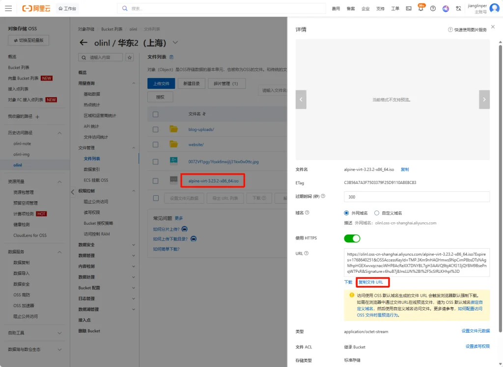
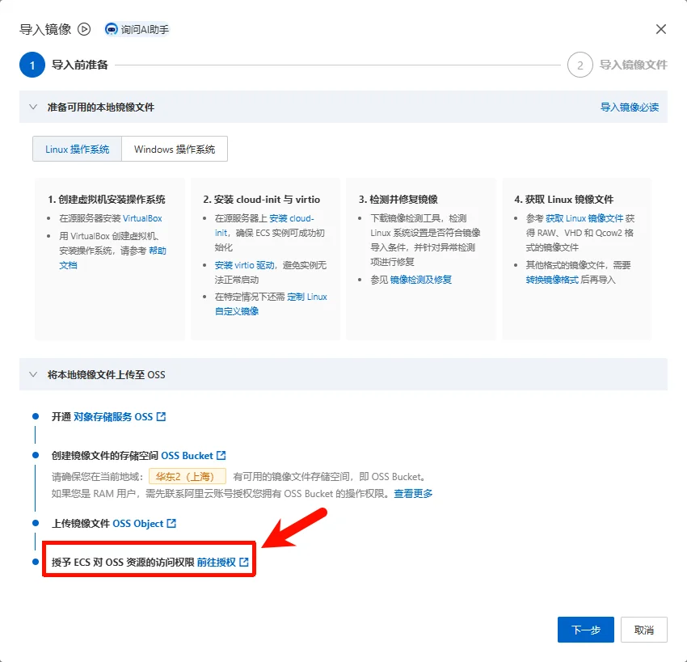
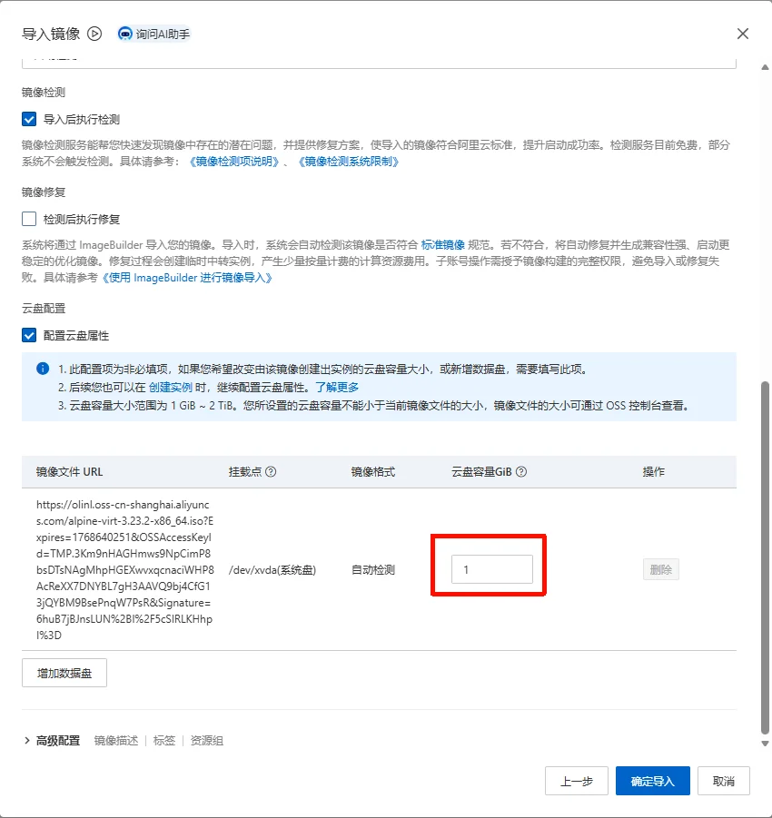

---
title: Alpine Linux 极简安装流程与生产环境轻量化配置
slug: alpine-install-config
published: 2025-03-01 00:00:00
updated: 2025-03-01 00:00:00
description: 追求极致轻量？本文带你快速上手 Alpine Linux 安装与 APK 包管理，教你如何配置资源占用极低的微服务生产环境。
image: api
category: 系统运维
tags: ["系统安装", "Alpine"]
draft: false
# pinned: false
---

起因：站长的服务都是部署在家里，通过Frp映射到公网上的，最近有服务器要到期了，研究了下阿里云的ECS计费，决定使用一款轻量级的Linux系统，购买阿里云 2vCPU 0.5GB的服务器，3年仅需300多，如果使用学生优惠券，基本免费。带宽按量付费，使用CDT（云数据传输），国内每个月20G免费流量，境外每个月220G免费流量。

然而，在 2vCPU 0.5GB 这个"螺蛳壳里做道场"的极限配置下，我们熟悉的 CentOS、Ubuntu 甚至 Debian 都显得有些"富态"了。它们安装后动辄占用数百 MB 内存，留给应用本身的空间已然不多。

**我们的目标非常明确：在有限的资源内，榨干每一分性能。** 这时，一个专为资源受限环境而生的系统进入了视野——**Alpine Linux**。它基础运行内存仅需 **5-10 MB**，安装后硬盘占用不到 **100 MB**，恰恰是这种超轻量级服务器的"天作之合"。选择 Alpine，不是追逐潮流，而是在极致性价比方案下的**必然技术选择**。

## 一、开始安装

Alpine 60M镜像链接

```sql
https://dl-cdn.alpinelinux.org/alpine/v3.23/releases/x86_64/alpine-virt-3.23.2-x86_64.iso
```

### 1. 阿里云添加自定义镜像

因为阿里云不提供Alpine的镜像，我们要使用自定义镜像，下面跟我一起配置吧

1) 将镜像上传至阿里云OSS

> 由于我们需要自定义镜像，但是镜像又必须要通过OSS提供，所以我们需要临时性的创建一个OSS Bucket实例，来上传我们的ISO镜像。在实例成功创建后，我们可以将其删除，以避免不必要的扣费

首先，来到 [OSS管理控制台](https://oss.console.aliyun.com/index) ，创建一个 Bucket，地域一定要选你服务器所在的区域 ，并且上传ISO，最后，复制URL备用



2) 导入镜像

前往 [云服务器管理控制台](https://ecs.console.aliyun.com/image/region/cn-shanghai) ，选择到所属的地区，然后选择右上角的 导入镜像


注意，需要授权ECS访问OSS业务



然后正常填写，**取消勾选"导入后执行检测"** ，先不要点下一步

接下来勾选配置云盘属性，并且将 **云盘容量设置为1GB** ，确认无误，导入



### 2. 安装Alpine系统

> 如果你使用阿里云自定义镜像进行安装了，需要使用vnc远程链接进行安装系统，别家的厂商也是一样。
>
> 进入 云服务器管理控制台 选择你刚买的ECS，接下来点击 远程连接 ，展开更多，选择 通过VNC远程连接

接下来就是愉快的敲命令环节~ （方括号内为默认值，你可以输入新值回车覆盖也可以直接回车应用默认值）

- 启动 Alpine 安装程序

```sql
localhost:~# setup-alpine
```

- 选择键盘布局

```sql
Select keyboard layout: [none] us
Select variant: [us]
```

- 设置主机名

```sql
Enter system hostname (fully qualified form, e.g. 'foo.example.org') [localhost] alpine-vps
```

- 设置网卡

```sql
Available interfaces are: eth0 lo
Which one do you want to initialize? [eth0]
```

- 设置 IP 获取方式

```sql
Ip address for eth0? (or 'dhcp', 'none', 'manual') [dhcp]
```

- 是否进行手动网络配置

```sql
Do you want to do any manual network configuration? [no]
```

- 设置 root 密码（输入时不会显示）

```sql
New password:
Retype password:
```

- 设置时区，或者（PRC）

```sql
Which timezone are you in? ('?' for list) [UTC] Asia/Shanghai
```

- 设置代理

```sql
HTTP/FTP proxy URL? [none]
```

- 选择软件仓库镜像。这个地方建议先输入 `s` 列出所有镜像，然后上下翻找找到阿里云镜像源，然后输入对应镜像源编号，否则如有选错

```sql
Which mirror do you want to use? (or '?' or 'done') [44]
```

- 不创建普通用户

```sql
Setup a user? (enter a username, or 'no') [no] no
```

- 选择 SSH 服务

```sql
Which SSH server? ('openssh', 'dropbear', or 'none') [openssh]
```

- 是否允许 root 通过 SSH 登录

```sql
Allow root ssh login? ('?' for help) [prohibit-password] yes
```

- 没有找到磁盘，是否安装至 vda 云盘，是

```sql
No disk available, Try boot media /media/vda ? (y/n) [n] y
```

- 选择要安装的磁盘

```sql
Which disk(s) would you like to use? (or '?' for help or 'none') [none] vda
```

- 选择磁盘使用方式

```sql
How would you like to use it? ('sys', 'data', 'crypt', 'lvm') [sys]
```

- 确认格式化磁盘

```sql
WARNING: Erase the above disk(s) and continue? [y/N] y
```

- 安装系统

```sql
Installing system on /dev/sda:
  Installing alpine-base...
  Installing busybox...
  Installing openssh...
  Installing openrc...
```

- 安装完成提示

```sql
Installation is complete. Please reboot.
```

- 重启系统

```sql
localhost:~# reboot
```

## 二、配置系统

在安装完 Alpine 系统后，需要进行一些配置，才能正常使用。

### 1. 设置DNS

一般情况下不需要，云厂商会帮你配置好

```bash
alpine-vps:~# setup-dns
DNS Domain name? (e.g. 'bar.com') nameserver
DNS nameserver(s)? [223.5.5.5] 1.1.1.1 8.8.8.8
```

### 2. 换源并更新

```bash
# 配置社区阿里云源
cd /etc/apk
vi repositories
## 取消 community 仓库前面的注释符号（#）。

## 可选edge源
http://mirrors.aliyun.com/alpine/edge/community
http://mirrors.aliyun.com/alpine/edge/testing

# 更新系统及软件包
apk update
apk upgrade
```

### 3. 配置 IP 信息

在这里可以将dhcp改为静态配置

```bash
# 编辑网络配置文件
vi /etc/network/interfaces
## 将默认的 DHCP 配置修改为静态 IP
auto eth0
iface eth0 inet static
   address 192.168.1.100
   netmask 255.255.255.0
   gateway 192.168.1.1
   dns-nameservers 8.8.8.8

# 配置 DNS（可选）
vi /etc/resolv.conf

nameserver 8.8.8.8

# 重启网络服务 使配置立即生效
ifdown eth0 && ifup eth0
```

### 4. 安装基本软件包

```bash
apk add --no-cache vim openssh util-linux bash bash-doc  bash-completion curl net-tools unzip zip jq openssl tar iproute2 lsblk htop
```

### 5. 校时

```bash
# 设置时区
setup-timezone -z Asia/Shanghai

# 使用 chrony进行校时
## 安装 chrony
apk add chrony

## 启动服务并设置开机自启
rc-service chronyd start
rc-update add chronyd
```

## 三、系统相关命令

这里记录了 Alpine 系统常用的命令

### 1. APK命令

```bash
apk update  # 更新最新镜像源列表

apk search                 # 查找所有可用软件包
apk search -v              # 查找所用可用软件包及其描述内容
apk search -v '包名'       # 通过软件包名称查找软件包
apk search -v -d 'docker'  # 通过描述文件查找特定的软件包

apk add openssh                       # 安装一个软件
apk add openssh  vim  bash nginx      # 安装多个软件
apk add --no-cache mysql-client       # 不使用本地镜像源缓存，相当于先执行update，再执行add

apk info           # 列出所有已安装的软件包
apk info -a zlib   # 显示完整的软件包信息
apk info --who-owns /usr/sbin/nginx # 显示指定文件属于的包

apk upgrade            # 升级所有软件
apk upgrade openssh    # 升级指定软件
apk upgrade openssh  vim  bash nginx # 升级多个软件
apk add --upgrade busybox  # 指定升级部分软件包

apk del openssh      # 删除一个软件
apk del nginx mysql  # 删除多个软件
```

### 2. rc服务命令

Alpine 不使用 systemctl 而是 OpenRC，这对于习惯了 Ubuntu/CentOS 的人来说是最大的门槛。建议在"系统相关命令"部分加一个直观的对比表：

```bash
rc-update    # 主要用于不同运行级增加或者删除服务。
rc-status    # 主要用于运行级的状态管理。
rc-service   # 主用于管理服务的状态
openrc       # 主要用于管理不同的运行级。


rc-service <服务名> start    # 启动服务
rc-service <服务名> stop    # 停止服务
rc-service <服务名> restart  # 重启服务
rc-service <服务名> reload    # 重新加载配置（不重启）
rc-service <服务名> status    # 查看服务状态


rc-update add <服务名> <运行级别>    # 添加服务到开机自启
rc-update del <服务名>          # 删除服务的开机自启
rc-update show            # 查看所有开机自启的服务

# 运行级别说明
## boot - 系统启动时运行
## default - 默认运行级别（多用户模式）
## nonetwork - 无网络模式
## single - 单用户模式（维护模式）
rc-update add 服务名 boot      # 核心服务（如docker）
rc-update add 服务名 default    # 普通服务（如nginx、ssh）


tail -f /var/log/messages    # 查看所有系统日志
tail -f /var/log/messages | grep docker    # 查看特定服务的日志
ls /var/log/ | grep -E "(docker|nginx|ssh)"    # 查看服务自己的日志文件（如果有）
```

## 四、FRP服务安装

FRP 是一个反向代理工具，它可以将本地服务暴露到公网，实现远程访问。

下载FRP：https://github.com/fatedier/frp/releases

如果网络不好可以使用gh镜像站点

```bash
wget https://github.com/fatedier/frp/releases/download/v0.67.0/frp_0.67.0_linux_amd64.tar.gz
```

---

```bash title="frpc"
# 创建 OpenRC 服务文件
tee /etc/init.d/frpc <<'EOF'
#!/sbin/openrc-run

# 基础信息
name="frp client"
description="FRP Client with Infinite Auto-Restart"

# 执行程序和参数
command="/opt/frp/frpc"
command_args="-c /opt/frp/frpc.toml"
command_user="root"

# 核心守护配置
supervisor="supervise-daemon"
respawn_delay=10
respawn_max=0 # 无限次重试

# 依赖网络和 DNS
depend() {
    need net
    use dns
    after firewall
}

# 启动前的清理工作
start_pre() {
    # 强制清理可能锁死服务的 PID 文件
    rm -f /run/${RC_SVCNAME}.pid
    checkpath --directory --owner root:root /run/${RC_SVCNAME}
}

EOF

# 设置权限并添加服务
chmod +x /etc/init.d/frpc

# 启动服务
rc-service frpc start

# 停止服务
rc-service frpc stop

# 查看状态
rc-service frpc status

# 重启服务
rc-service frpc restart


# 开机自启
rc-update add frpc default

```

---

```bash title="frps"
# 创建 OpenRC 服务文件
tee /etc/init.d/frps <<'EOF'
#!/sbin/openrc-run

# 基础信息
name="frp server"
description="FRP Server with Infinite Auto-Restart"

# 执行程序和参数
command="/opt/frp/frps"
command_args="-c /opt/frp/frps.toml"
command_user="root"

# 核心守护配置
supervisor="supervise-daemon"
respawn_delay=10
respawn_max=0 # 无限次重试

# 依赖网络和 DNS
depend() {
    need net
    use dns
    after firewall
}

# 启动前的清理工作
start_pre() {
    # 强制清理可能锁死服务的 PID 文件
    rm -f /run/${RC_SVCNAME}.pid
    checkpath --directory --owner root:root /run/${RC_SVCNAME}
}

EOF

# 设置权限并添加服务
chmod +x /etc/init.d/frps

# 启动服务
rc-service frps start

# 停止服务
rc-service frps stop

# 查看状态
rc-service frps status

# 重启服务
rc-service frps restart


# 开机自启
rc-update add frps default

```

## 五、Docker安装

```bash
# 启用cgroups
rc-update add cgroups boot
rc-service cgroups start
# 检查是否挂载
mount | grep cgroup

# 安装docker
apk add docker docker-compose

# 配置文件
## 创建配置目录
mkdir -p /etc/docker

## 配置daemon.json
cat > /etc/docker/daemon.json << 'EOF'
{
  "log-driver": "json-file",
  "log-opts": {
    "max-size": "5m",
    "max-file": "2"
  },
  "storage-driver": "overlay2",
  "default-ulimits": {
    "nofile": {
      "Name": "nofile",
      "Hard": 1024,
      "Soft": 512
    }
  },
  "max-concurrent-downloads": 1,
  "max-concurrent-uploads": 1
}
EOF

## 重启Docker使配置生效
rc-service docker restart
```

> [!NOTE]
> 站长提示： 在 512MB 内存的机器上，限制 Docker 并发下载数（设置为 1）至关重要，否则多个线程同时拉取镜像会瞬间撑爆内存导致系统卡死（OOM）。
>
> `max-concurrent-downloads: 1` 能有效防止拉取镜像时因并发过高导致的 OOM（内存溢出）。

至此，一个极其轻量且功能完备的 Alpine 生产环境就搭建完成了。

## 编辑建议

> 以下建议基于本条目内容生成，仅供发布前参考。

### 文章内容建议
- 建议补充"安装后首次登录的安全基线"小节：包括 `passwd` 强制复杂度、SSH 改默认端口、`PermitRootLogin prohibit-password` 配合密钥、`apk audit` 检查 CVE 等。
- 文章引用了 `apline-v3.23.2`，建议在文首加一行说明该镜像版本对应的发布/支持周期，避免读者使用过期版本（如有更新主线请同步替换）。
- 第四、第五章（FRP + Docker）篇幅较重且与 Alpine 安装本身弱相关，建议在目录里清晰标记为"二、进阶服务"，并补充每条命令的回滚/停止方法（如 `rc-update del frpc default`）。
- "二、配置系统 - 3. 配置 IP 信息"里给的 192.168.1.0/24 网段示例与不同云厂商默认网段可能冲突，建议改为 RFC 5737 文档保留网段 `192.0.2.0/24`、`198.51.100.0/24`，避免被读者直接拷贝到生产。

### 修改建议
- 文中 SQL 语言标签的代码块其实是 shell 命令（如 `setup-alpine` 流程、`setup-dns`），建议统一改为 `bash` 标签，提升可读性与高亮正确性。
- "三、1. APK命令" 段落可以整理为表格：命令 + 用途 + 备注，删除多余空行。
- 第四、五章的 OpenRC 服务文件用了 `tee` + heredoc 写法，建议在首次出现的位置加一句"OpenRC 等价 systemctl"对照表（`rc-service X start` ≈ `systemctl start X`），降低读者切换成本。

### 合并建议
- 候选合并对象：`chrony-time-sync`（文章里"校时"一节装了 chrony，与独立文章内容重复）、`jar-service-script`（`jar-service-script` 也是 OpenRC 服务脚本范例，可作为延伸链接而非重复内容）
- 合并理由：当前文章在"校时"小节展开了 chrony 的完整配置，与 `chrony-time-sync` 高度重叠，建议改为外链并保留一句"参考《chrony-time-sync》一文"；OpenRC 模板与 jar-service-script 的脚本可互为补充，无需合并正文。

### slug 建议
- 当前：`alpine-install-config`
- 建议：保留
- 理由：slug 简洁、表意明确（Alpine + 安装 + 配置），与同系列 `centos-install-config`、`debian-install-config`、`ubuntu-install-config` 命名风格一致。

### 分类建议
- 建议归类到：系统
- 理由：内容主体是 OS 安装（Alpine 3.23）、基础网络/时区/源配置与 OpenRC 服务脚本，归入新分类"系统"（OS 安装、底层工具、脚本）最贴合。

### tags 建议
- 建议：`[Alpine, OpenRC, 轻量化]`
- 与现状对比：`[系统安装, Alpine]`，差异说明：原 tags 中的"系统安装"含义过宽，改为更聚焦的"OpenRC"（突出本文与其他安装文档的差异点）和"轻量化"（Alpine 的核心卖点）。如需压缩到 1-3 tag，可保留 `[Alpine, OpenRC]`。

### 其他建议
- 文中引用了阿里云 OSS 导入镜像流程，建议在开头加一段"为什么用 custom image"的 1-2 句话背景，方便不熟悉阿里云 ECS 的读者快速判断是否需要走这条路。
- 命令块里有部分注释用中文、部分用英文（如 `# 检查是否挂载` vs `# Installing alpine-base...`），建议统一为中文或英文注释，降低阅读跳脱。
