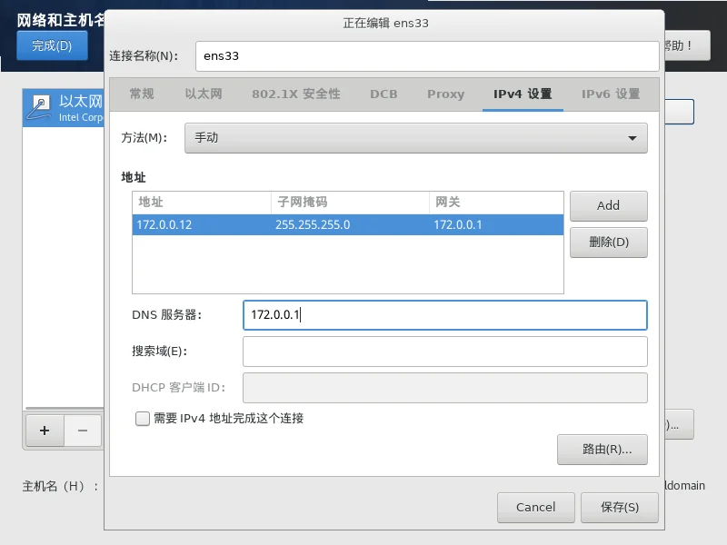

---
title: CentOS 安装与服务器初始化配置完整指南
slug: centos-install-config
published: 2025-03-01 00:00:00
updated: 2025-03-01 00:00:00
description: 详述 CentOS 从零安装、分区到网络与防火墙配置全流程。助你快速构建稳定、安全的生产级 Web 服务器环境。
image: api
category: 系统运维
tags: ["系统安装", "CentOS"]
draft: false
# pinned: false
---

> [!NOTE]
> CentOS停更说明：CentOS操作系统已全面停止维护（EOL），继续使用会使系统暴露在新的安全漏洞之下，成为攻击目标，并可能违反相关安全合规要求。
>
> 阿里云：[CentOS 操作系统](https://help.aliyun.com/zh/ecs/user-guide/options-for-dealing-with-centos-linux-end-of-life)

## 一、下载镜像

Centos7镜像包：

```sql
# 华为云镜像站
https://mirrors.huaweicloud.com/centos/7/isos/x86_64/CentOS-7-x86_64-DVD-2009.iso
```

烧录镜像（二选一）

- 使用 [Ventoy启动盘](https://www.ventoy.net/cn/index.html)
- 使用 [Rufus](https://rufus.ie/zh/)
- 使用 [Balenaetcher](https://etcher.balena.io/)
- 或者第三方镜像烧录工具

之后启动到U盘，进入安装流程，里面没什么可说的，都是可视化安装，下一步下一步即可。

## 二、开始安装

网络配置可以在安装界面配置，也可以使用 dhcp 在安装完成后配置，但是开关一定要打开，不然无法使用SSH连接，如果在安装的时候没有网络，也可以关闭，然后后面手动开启网卡服务。



如果root密码设置过于简单，需要点击两次完成才可继续安装。

## 三、系统配置

在我们安装完成一个系统后，通常需要进行一些必要的优化

### 1. 修改 IP 地址

可以先ping一下外网是否可以访问

```bash
ping baidu.com
```

```bash
# 网络正常
[root@harbor ~]# ping baidu.com
PING baidu.com (110.242.74.102) 56(84) bytes of data.
64 bytes from 110.242.74.102 (110.242.74.102): icmp_seq=1 ttl=51 time=20.2 ms
64 bytes from 110.242.74.102 (110.242.74.102): icmp_seq=2 ttl=51 time=20.0 ms
64 bytes from 110.242.74.102 (110.242.74.102): icmp_seq=3 ttl=51 time=26.6 ms
64 bytes from 110.242.74.102 (110.242.74.102): icmp_seq=4 ttl=51 time=20.0 ms
64 bytes from 110.242.74.102 (110.242.74.102): icmp_seq=5 ttl=51 time=20.0 ms
^C
--- baidu.com ping statistics ---
5 packets transmitted, 5 received, 0% packet loss, time 4004ms
rtt min/avg/max/mdev = 20.061/21.424/26.605/2.595 ms
```

如果没有打印延迟等信息，就说明网络是断开的。

**查看网卡名称**

```bash
#查看网卡，通常是ens开头的
ip addr
```

```bash
# 查看网卡名称为ens33
[root@172-0-0-12 ~]# ip addr
1: lo: <LOOPBACK,UP,LOWER_UP> mtu 65536 qdisc noqueue state UNKNOWN group default qlen 1000
    link/loopback 00:00:00:00:00:00 brd 00:00:00:00:00:00
    inet 127.0.0.1/8 scope host lo
       valid_lft forever preferred_lft forever
    inet6 ::1/128 scope host
       valid_lft forever preferred_lft forever
2: ens33: <BROADCAST,MULTICAST,UP,LOWER_UP> mtu 1500 qdisc pfifo_fast state UP group default qlen 1000
    link/ether 00:0c:29:06:59:5c brd ff:ff:ff:ff:ff:ff
    inet 172.0.0.12/24 brd 172.0.0.255 scope global noprefixroute ens33
       valid_lft forever preferred_lft forever
    inet6 fe80::e1ff:d529:c8cb:6d1a/64 scope link noprefixroute
       valid_lft forever preferred_lft forever
```

**修改网卡配置**

```bash
# 修改网卡配置
# vi /etc/sysconfig/network-scripts/ifcfg-<网卡名称>
vi /etc/sysconfig/network-scripts/ifcfg-ens33
```

修改关键字段：

```bash

BOOTPROTO=static
ONBOOT=yes
IPADDR=192.168.1.100
NETMASK=255.255.255.0
GATEWAY=192.168.1.1
DNS1=8.8.8.8

```

> `BOOTPROTO`=static - 静态ip
>
> `ONBOOT`=yes - 启动时自动激活
>
> `IPADDR`=192.168.1.100 - ip地址
>
> `NETMASK`=255.255.255.0 - 掩码，通常为255.255.255.0
>
> `GATEWAY`=192.168.1.1 - 网关
>
> `DNS1`=8.8.8.8 - DNS地址

修改完成后保存，重启network服务

```bash

service network restart

# 对于使用旧版network服务的系统
/etc/init.d/network restart
/etc/init.d/network stop && /etc/init.d/network start

```

然后就可以正常联网了。

### 2. 更换yum源

> [!TIP]
> 由于centos7已经停止服务，部分源已经无法访问，如果显示404等问题，请自行寻找可用源

```bash

# 备份yum源
mv /etc/yum.repos.d/CentOS-Base.repo /etc/yum.repos.d/CentOS-Base.repo.backup

# 下载国内yum源配置文件
## 如果无法使用可以手动创建文件然后复制进去
vi /etc/yum.repos.d/CentOS-Base.repo
## 阿里源（推荐）：
wget -O /etc/yum.repos.d/CentOS-Base.repo http://mirrors.aliyun.com/repo/Centos-7.repo
### 当wget无法使用时
#curl -o /etc/yum.repos.d/CentOS-Base.repo http://mirrors.aliyun.com/repo/Centos-7.repo
## 网易源：
wget -O /etc/yum.repos.d/CentOS-Base.repo http://mirrors.163.com/.help/CentOS7-Base-163.repo
### 当wget无法使用时
#curl -o /etc/yum.repos.d/CentOS-Base.repo http://mirrors.163.com/.help/CentOS7-Base-163.repo

# 清理yum缓存，并生成新的缓存
yum clean all
yum makecache

# 更新yum源
yum update -y

```

### 3. 硬盘操作

此操作可以借助lvm2工具，详细操作见另一篇文章：

[Olinl Blog - LVM 硬盘工具使用教程](/posts/lvm-setup/)

### 4. 配置 SELinux

SELinux 是 CentOS 7 的安全模块，它可以提高系统的安全性。但是，如果不正确配置，它可能会导致一些问题。以下是一些常见的 SELinux 配置
```bash

# 临时禁用SELinux
setenforce 0

# 永久禁用SELinux
vi /etc/selinux/config
## 修改为下面内容
SELINUX=disabled

#注意！修改后需重启系统才能生效

```

## 四、 安装必要的软件包

```bash

yum -y install  epel-release
yum -y install wget vim net-tools telnet lsof tree htop zip unzip iperf3

```

> [!NOTE]
> - wget：用于下载文件和网页
> - vim：用于编辑文本文件
> - net-tools：用于管理网络配置
> - telnet：用于测试网络连接
> - lsof：用于查看系统打开的文件
> - tree：用于查看目录结构
> - htop：用于更好的查看进程
> - zip、unzip：用于解压缩zip文件
> - iperf3：内网测速工具

## 五、防火墙操作

通常情况下我们使用的是 vpc，云厂商会自带防火墙服务，我们可以将防火墙直接关闭。

```bash

# 停止防火墙服务
systemctl stop firewalld.service
# 停止开机自启
systemctl disable firewalld.service

```

如果你认为系统的防火墙非常重要，想要使用，请往下看

**添加一个端口**

```bash

# 添加端口
## --permanent永久生效，没有此参数重启后失效
firewall-cmd --zone=public --add-port=5005/tcp --permanent

# 添加端口外部访问权限（这样外部才能访问）
firewall-cmd --add-port=5005/tcp

# 更新防火墙规则
firewall-cmd --reload

```

**查看端口是否开放**

```bash
firewall-cmd --zone=public --query-port=80/tcp
```

**删除开放的端口**

```bash
firewall-cmd --zone=public --remove-port=80/tcp --permanent
```

**查看firewall是否运行**

```bash
# 两个命令都可以
systemctl status firewalld

firewall-cmd --state
```

**查看开启了哪些服务**

```bash
firewall-cmd --list-services
```

**查看所有打开的端口**

```bash
firewall-cmd --zone=public --list-ports
```

## 六、一键运行脚本

**包含更新阿里yum源，安装软件包，关闭防火墙**

```bash
yum install wget -y
mv /etc/yum.repos.d/CentOS-Base.repo /etc/yum.repos.d/CentOS-Base.repo.backup
curl -o /etc/yum.repos.d/CentOS-Base.repo http://mirrors.aliyun.com/repo/Centos-7.repo
yum clean all
yum makecache
yum update -y
yum -y install  epel-release
yum -y install wget vim net-tools telnet lsof tree htop zip unzip iperf3
systemctl stop firewalld.service
systemctl disable firewalld.service
```

## 七、常用命令

### 1. 修改主机名

```bash
# 查看主机名
hostname
# 修改主机名
hostnamectl set-hostname 主机名
```

### 2. 配置免密登录

```bash
# 在A客户端上生成公钥和私钥
ssh-keygen -t rsa


# ====================================================
# 拷贝及配置方案
ssh-copy-id -i ~/.ssh/id_rsa.pub 'root@要拷贝到的机器ip'
```

### 3. 配置hosts

服务器多的时候可以配置hosts，直接通过关键字访问，避免使用ip访问，以免更换ip时还要修改配置

```bash title="/etc/hosts"

vim /etc/hosts

# 添加配置格式
#ip地址 别名
192.168.0.100 vm100

```

```bash title="或者使用heredoc写入"
# 使用heredoc写入
sudo tee -a /etc/hosts << EOF
192.168.0.100 vm100
EOF
```

### 4. 使用scp传输文件

**从服务器上下载文件**

例如：把 192.168.0.101 上的 /data/test.txt 的文件下载到 /home（本地目录）

```bash
#scp 用户名@服务器地址:要下载的文件路径 保存文件的文件夹路径
scp root@192.168.0.101:/data/test.txt /home
```

**上传本地文件到服务器**

例如：把本机 /home/test.txt 文件上传到 192.168.0.101 这台服务器上的 /data/ 目录中

```bash
#scp 要上传的文件路径 用户名@服务器地址:服务器保存路径
scp /home/test.txt root@192.168.0.101:/data/
```

**从服务器下载整个目录**

例如：把 192.168.0.101 上的 /data 目录下载到 /home（本地目录）

```bash
#scp -r 用户名@服务器地址:要下载的服务器目录 保存下载的目录
scp -r root@192.168.0.101:/data  /home/
```

**上传目录到服务器**

例如：把 /home 目录上传到服务器的 /data/ 目录

```bash
#scp -r 要上传的目录 用户名@服务器地址:服务器的保存目录
scp -r /home root@192.168.0.101:/data/
```

### 5. 安装rpm包

```bash
# 批量安装rpm
rpm -ivh *.rpm

# 查询并过滤已安装的软件包
## -qa 参数表示查询所有（-q）已安装的软件包（-a）grep表示过滤
rpm -qa | grep firefox

# 卸载
rpm -e firefox

# 带参数安装
rpm -ivh *.rpm --nodeps --force
```

### 6. 赋权

```bash
# 赋予读写权限
chmod -R 777 文件或目录
# chmod -R 777 /usr/local/mysql/*

# 赋予可执行权限
chmod +x 文件
```

### 7. 查看端口占用

```bash
yum -y install lsof

lsof -i tcp:80

# 关掉占用的服务
kill pid
kill -9 pid
```

## 八、为什么 2026 年我们还在用 CentOS 7？

在 2026 年的今天，距离 CentOS 7 官方正式停止维护（2024 年 6 月 30 日）已经过去了近两年。然而，在许多大型企业、传统制造业甚至核心银行系统中，你依然能看到这个"老古董"的身影。

这不是因为运维人员懒，而是因为在现实的生产环境中，**"稳"永远大于"新"**。以下是为什么 2026 年我们依然离不开 CentOS 7 的四大残酷现实：

---

### 1. 核心业务的"内核"依赖

许多大型闭源软件（如旧版 Oracle 数据库、行业专用的 ERP）是针对 CentOS 7 的 **3.10 内核** 深度定制和认证的。

* **驱动不匹配**：新系统的内核（如 5.x 或 6.x）可能删除了旧硬件的驱动支持。
* **ABI 兼容性**：某些老旧的二进制文件在新版 GLIBC 库下运行会出现不可预知的崩溃。

### 2. 迁移成本 = 天价预算 + 巨大风险

迁移一个运行了十年的生产环境，成本往往高得吓人。

* **人力成本**：需要重写成千上万行的自动化脚本（从 `init` 彻底转向 `systemd` 的所有细节）。
* **测试风险**：即使是细微的性能抖动，在处理每秒万级并发的业务时都可能是致命的。

> **运维圈名言**："只要业务还能跑，谁动谁就是那个背锅位。"

### 3. 工业与科研设备的"终身伴侣"

在工厂自动化、医疗精密仪器领域，控制服务器往往是跟随设备一起交付的。

* **厂商停产**：当初开发驱动的硬件厂商可能已经倒闭或转行，再也没有人为新系统写驱动。
* **物理隔离**：这些机器通常运行在完全断开互联网的内网环境，安全漏洞的威胁被物理降维。

### 4. 极其成熟的"续命"生态

即便官方源停了，国内的阿里、清华、华为等镜像站依然保留着 `vault` 仓库（归档库）。

* **文档丰富**：你遇到的任何报错，在网上都能找到 2017 年至 2023 年间的完美解决方案。
* **脚本积累**：运维团队手里有大量打磨了数年的 CentOS 7 调优脚本。

---

### 🛡️ 2026 年留守 CentOS 7 的生存法则

如果你由于某种不可抗力必须继续使用它，请务必执行以下"续命"操作：

1. **切换 Vault 源**：确保你的 `/etc/yum.repos.d/` 指向国内的归档仓库，否则无法安装任何基础工具。
2. **严禁暴露公网**：CentOS 7 的漏洞库已经堆积如山，绝对不能把 SSH 端口（22）直接暴露在公网。
3. **快照常态化**：在没有安全补丁的时代，数据备份是最后一道防线。

## 编辑建议

> 以下建议基于本条目内容生成，仅供发布前参考。

### 文章内容建议
- 建议补充 Vault 源切换的完整配置模板（vault.centos.org + 国内镜像如阿里 vault 仓库），并附 `vault.centos.org` 官方归档的可用性说明，避免读者照搬"七、一键运行脚本"后 yum 报 404。
- 文首已写"CentOS 已 EOL"，但第六章一键脚本默认走的是 `mirrors.aliyun.com/repo/Centos-7.repo`，仍假定主源可用；建议改为"必须先切 vault 源，否则一键脚本不生效"，并提供完整一键脚本的 vault 适配版。
- 建议补充"CentOS Stream / Rocky / AlmaLinux 迁移指引"链接到 1-2 篇延伸阅读（如本站 `server-init` 文中已经涉及 Ubuntu MySQL，可顺手做迁移章节）。

### 修改建议
- "一、下载镜像"小节只给了 CentOS 7 链接，但后文 yum 源、`firewalld` 都是 CentOS 7 行为；建议在文首小节也明确"本文以 CentOS 7 为例"，与 CentOS 8/9 行为区分。
- 第五章 firewall 命令存在中英文混排的双引号（如 `firewall-cmd --zone=public`），可统一为半角，避免复制后报错。
- 第八章"为什么 2026 年我们还在用 CentOS 7"是高质量长文，但夹在系统教程中间会冲淡主线，建议拆分为独立文章 `centos-7-2026-eol-survival` 或合并到 `server-init` 的迁移章节。

### 合并建议
- 候选合并对象：`server-init`（都涉及服务器初始化流程）、`lvm-setup`（"三、系统配置 - 3. 硬盘操作"小节直接链接过去，不算合并候选）
- 合并理由：本文的"基础优化 + 一键脚本"与 `server-init` 中"基础配置 + 换源 + 时区"存在轻度重复；但本文偏重 CentOS 7、`server-init` 偏重 K8s + 中间件安装，建议保留独立，但把"一键脚本"章节挪到 `server-init` 中作为通用模板，本章只留差异化部分。

### slug 建议
- 当前：`centos-install-config`
- 建议：保留
- 理由：slug 命名与同系列（alpine/debian/ubuntu-install-config）一致，且已通过 frontmatter `updated` 标注 2026-03-01，语义清晰。

### 分类建议
- 建议归类到：系统
- 理由：内容覆盖 OS 安装（CentOS 7 镜像烧录、分区、静态 IP）、初始化（yum 源、SELinux、防火墙）与常用命令（scp、rpm、chmod），与新分类"系统"的"OS 安装、初始化、底层工具、脚本"完全对应。

### tags 建议
- 建议：`[CentOS, 安装, 初始化]`
- 与现状对比：`[系统安装, CentOS]`，差异说明：原 tags 中"系统安装"含义宽泛且与多文重复，拆分为更具体的"安装"+"初始化"两个主题词，便于在标签云中区分"安装类"和"调优类"内容。

### 其他建议
- 第六章"一键运行脚本"建议加上 `# 仅适用于 CentOS 7 EOL 后的 vault 源场景` 的注释头，避免新读者误用到 CentOS 8+ 环境。
- 文末"为什么 2026 年我们还在用 CentOS 7"段落可加配 1 张统计图（CentOS 7 在 Netcraft/各云厂商的市占率变化），增强数据说服力。
