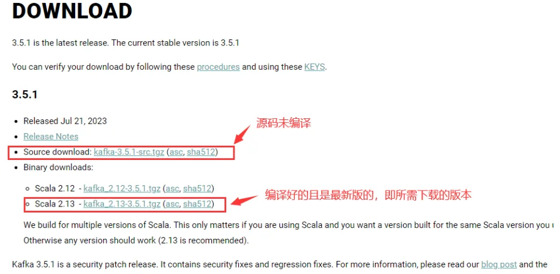

---
title: Kafka 跨平台安装与基础使用指南（Linux / Windows）
slug: centos-kafka-install
published: 2025-01-15 00:00:00
updated: 2025-01-15 00:00:00
description: 介绍在 Linux 和 Windows 下安装 Apache Kafka，配置 ZooKeeper 与 Kafka Broker，并演示常用的 Topic 管理与消息生产消费命令。
image: api
category: 中间件
tags: ["Kafka", "消息队列"]
draft: false
# pinned: false
---

> [!WARNING]
> 本文内容来源于参考教程整理，部分步骤未经实机验证，仅供参考。如有问题请以官方文档为准。

Kafka 下载地址：[https://kafka.apache.org/downloads](https://kafka.apache.org/downloads)



## 一、安装

Linux 下载并解压：

```bash
# 解压到指定目录
tar -zxvf kafka_2.13-3.5.1.tgz
mv kafka_2.13-3.5.1 /opt/kafka
```

Windows 直接解压到合适路径即可（建议纯英文路径，如 `D:\env-java\`）。

> [!NOTE]
> - Linux 命令在 `bin/` 目录下执行
- Windows 命令在 `bin\windows\` 目录下执行

## 二、修改配置

编辑 `config/server.properties` 和 `config/zookeeper.properties`：

```bash
# Linux 配置示例
broker.id=1
log.dirs=/opt/kafka/logs

# Windows 配置示例
broker.id=1
log.dirs=D:/env-java/kafka_2.13-3.5.1/kafka-logs
```

## 三、启动服务

```bash
# 启动 ZooKeeper
## Linux
bin/zookeeper-server-start.sh -daemon config/zookeeper.properties
## Windows
bin\windows\zookeeper-server-start.bat config\zookeeper.properties

# 启动 Kafka
## Linux（后台启动，推荐）
cd /opt/kafka
nohup bin/kafka-server-start.sh config/server.properties 2>&1 &
# 或者
bin/kafka-server-start.sh -daemon config/server.properties

## Windows
bin\windows\kafka-server-start.bat config\server.properties
```

## 四、常用操作

```bash
# 创建 Topic
## Linux
bin/kafka-topics.sh --create --bootstrap-server localhost:9092 \
  --replication-factor 1 --partitions 1 --topic test

# 查看 Topic 列表
bin/kafka-topics.sh --list --bootstrap-server localhost:9092

# 查看 Topic 详情
bin/kafka-topics.sh --describe --bootstrap-server localhost:9092 --topic test

# 删除 Topic
bin/kafka-topics.sh --delete --bootstrap-server localhost:9092 --topic test

# 启动 Producer（生产者）
bin/kafka-console-producer.sh --broker-list localhost:9092 --topic test

# 启动 Consumer（消费者，从头消费）
bin/kafka-console-consumer.sh --bootstrap-server localhost:9092 \
  --topic test --from-beginning

# 删除 Topic 数据（需要 delete_script.json 文件）
bin/kafka-delete-records.sh --bootstrap-server localhost:9092 \
  --offset-json-file delete_script.json
```

`delete_script.json` 文件格式：

```json
{
  "partitions": [
    {
      "topic": "test",
      "partition": 0,
      "offset": -1
    }
  ]
}
```
