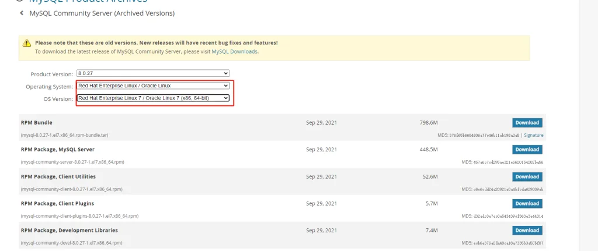

---
title: CentOS 安装 MySQL 5.7 完整指南
slug: centos-mysql-57
published: 2025-01-11 00:00:00
updated: 2025-01-11 00:00:00
description: 详解在 CentOS 7 上通过 RPM 包安装 MySQL 5.7 的完整流程，涵盖自定义数据目录、外部访问配置及用户权限管理。
image: api
category: 中间件
tags: ["MySQL", "CentOS", "数据库"]
draft: false
# pinned: false
---

采用官网 RPM 包安装，版本为 MySQL 5.7 最后一个稳定版。

## 一、下载解压

打开 MySQL 社区版下载网站：[https://downloads.mysql.com/archives/community](https://downloads.mysql.com/archives/community)

CentOS 是基于红帽的，Select OS Version 选择 Linux 7，如下图



```bash
# 官网 mysql 5.7 下载地址
https://downloads.mysql.com/archives/get/p/23/file/mysql-5.7.44-1.el7.x86_64.rpm-bundle.tar
```

下载并解压

```bash
# 下载精简包
wget https://cdn.olinl.com/centos/mysql-5.7.44-1.el7.x86_64.rpm-bundle-lite.tar
# 官网全量包
# wget https://downloads.mysql.com/archives/get/p/23/file/mysql-5.7.44-1.el7.x86_64.rpm-bundle.tar

# 解压压缩包
tar -xvf mysql-5.7.44-1.el7.x86_64.rpm-bundle-lite.tar
```

## 二、安装

```bash
# 按顺序依次安装（顺序不可乱）
rpm -ivh mysql-community-common-5.7*.x86_64.rpm --nodeps --force
rpm -ivh mysql-community-libs-5.7*.x86_64.rpm --nodeps --force
rpm -ivh mysql-community-client-5.7*.x86_64.rpm --nodeps --force
rpm -ivh mysql-community-server-5.7*.x86_64.rpm --nodeps --force

# 查看已安装的 MySQL
rpm -qa | grep mysql
```

## 三、初始化与启动

### 1. 默认目录初始化

```bash
# 初始化 MySQL
mysqld --initialize
# 给数据目录权限
chown mysql:mysql /var/lib/mysql -R
# 启动服务
systemctl start mysqld.service
# 设置开机自启
systemctl enable mysqld

# 查看初始密码
cat /var/log/mysqld.log | grep password

# 登录并修改密码
mysql -uroot -p
## 输入上面获取的初始密码，然后执行：
ALTER USER 'root'@'localhost' IDENTIFIED WITH mysql_native_password BY 'your_password';
FLUSH PRIVILEGES;
```

### 2. 自定义数据目录

> [!WARNING]
> 设置自定义目录前，务必禁用 SELinux，否则 MySQL 无法访问自定义路径。

以 `/opt/mysql/data` 为例，先修改 `/etc/my.cnf`：

```ini title="/etc/my.cnf"
[mysqld]
datadir=/opt/mysql/data
log-error=/opt/mysql/mysqld.log
socket=/opt/mysql/mysql.sock
```

然后执行初始化：

```bash
# 创建数据目录
mkdir -p /opt/mysql/data

# 赋权
chown mysql:mysql /opt/mysql -R

# 使用 mysql 用户初始化
sudo -u mysql mysqld --initialize --datadir=/opt/mysql/data

# 启动服务
systemctl start mysqld.service
systemctl enable mysqld

# 查看初始密码
cat /opt/mysql/mysqld.log | grep password

# 登录并修改密码
mysql -uroot -p
ALTER USER 'root'@'localhost' IDENTIFIED WITH mysql_native_password BY 'your_password';
FLUSH PRIVILEGES;
```

## 四、配置外部访问

MySQL 安装后 root 用户默认只允许 localhost 登录，生产环境建议新建专用用户，而非直接开放 root。

**推荐：新建允许外部访问的用户**

```sql
-- 登录 MySQL
mysql -uroot -p

-- 创建允许外部访问的用户
CREATE USER 'root'@'%' IDENTIFIED BY 'your_password';
GRANT ALL PRIVILEGES ON *.* TO 'root'@'%' WITH GRANT OPTION;
FLUSH PRIVILEGES;
```

**不推荐：直接修改 root 用户 host**

```sql
mysql -uroot -p

UPDATE mysql.user SET host = '%' WHERE user = 'root';
FLUSH PRIVILEGES;
```

> [!TIP]
> 安装完成后，建议使用 XtraBackup 定期备份数据库：[XtraBackup 备份与恢复](/posts/xtrabackup-backup/)
