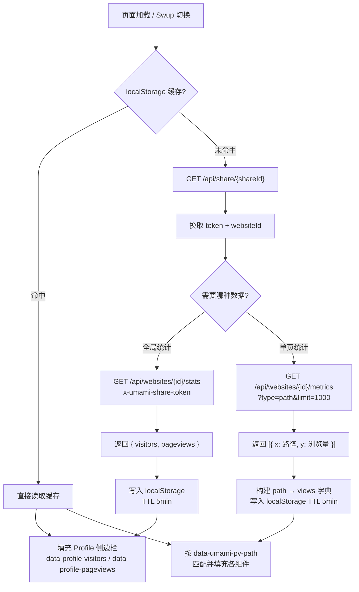

## 接入 Umami 浏览量统计（2026-07-04）

利用 Umami 自建实例的公开 Share API，在博客五个位置统一接入浏览量展示：

- **Profile 侧边栏** — 新增「浏览人数」和「浏览量」双栏统计卡片，调用 `/api/websites/{id}/stats` 获取全站数据
- **首页文章卡片 + 文章详情页** — 在标签后方显示单篇文章浏览量，调用 `/api/websites/{id}/metrics?type=path` 按路径匹配
- **友链页 / 留言页** — 标题栏右侧显示当前页面浏览量

数据通过客户端 `fetch` 获取，share token 缓存 24 小时、统计数据缓存 5 分钟，适配 Swup 页面切换自动刷新。

涉及文件：`analyticsConfig.ts`（新增 `shareId` / `shareApiBase`）、`i18nKey.ts` 及 5 个语言文件（新增 `pageVisitors`）、`Profile.astro`、`PostMeta.astro`、`PostCard.astro`、`[...slug].astro`、`friends.astro`、`guestbook.astro`。

### 数据获取流程

## 欢迎提示组件（2026-07-04）

新增右下角弹窗欢迎组件，首次访问时显示访客所在地（通过 IP 定位 API 获取），5 秒后自动关闭。基于 [欢迎提示组件 - Hyde Blog](https://seasir.top/blog/WelcomePrompt/) 的文章实现。

- **显示逻辑** — 使用 `sessionStorage` 记录访问标志，同一会话内不重复弹出
- **IP 定位** — 调用 `https://v2.xxapi.cn/api/ip` 获取地址，格式「你好，来自xxx的朋友」
- **自适应** — 深色模式适配，移动端居中显示

涉及文件：`WelcomeToast.astro`（新增）、`MainGridLayout.astro`（引入组件）、`global.d.ts`（Window 类型声明）。

## GitHub 活跃度热力图（2026-07-04）

新增侧边栏 GitHub 贡献热力图小组件，展示近 100 天的提交活跃度。参考 [Wine-Red/Firefly](https://github.com/Wine-Red/Firefly) 实现。

- **数据来源** — 服务端通过 jogruber 公开 API 拉取，无需 token
- **视觉效果** — 4 级 opacity 叠加主题色，与 Calendar 热力图风格统一
- **回退机制** — API 失败时显示提示，不影响页面渲染

涉及文件：`GitHubHeatmap.astro`（新增）、`SideBar.astro`（注册组件）、`sidebarConfig.ts`。

## 时间问候卡片（2026-07-04）

新增侧边栏实时时钟与分时段问候卡片。参考 [Wine-Red/Firefly](https://github.com/Wine-Red/Firefly) 实现。

- **实时时钟** — HH:MM / 星期 / 月日，每 60 秒刷新
- **分时段问候** — 深夜/早晨/上午/中午/下午/晚上六段问候语，图标自动切换
- **SPA 兼容** — IIFE 包裹，监听 swup:contentReplaced

涉及文件：`TimeGreeting.astro`（新增）、`SideBar.astro`（注册组件）、`sidebarConfig.ts`。

## Footer 底部改造（2026-07-04）

重构 Footer 组件，新增备案号和业务状态指示器。

- **备案号显示** — 工信部 ICP 备案和公安部公网安备，在 `footerConfig.ts` 填写 `number` 后自动渲染 badge
- **业务状态指示器** — 集成 Uptime Kuma，客户端 fetch heartbeat API，绿/黄/红三色自动切换
- **社交链接行** — 从 `profileConfig.links` 读取，过滤 RSS 后独立展示
- **布局优化** — 版权信息、RSS/Sitemap、Powered by 分行排列

涉及文件：`Footer.astro`（重构）、`footerConfig.ts`（新增 `icp`、`policeRecord`、`status` 字段）、`footerConfig.ts` 类型（扩展类型定义）。

## 短链接/重定向配置（2026-07-04）

新增 `redirectsConfig` 配置系统，支持定义短路径到目标地址的映射，由 Astro 内置 redirects 功能生成静态跳转页面。

- **内部跳转** — 如 `/link` → `/friends/`，访问短路径自动 301 跳转到站内页面
- **外部跳转** — 如 `/avatar-qlogo` → QQ 头像 API，直接跳转到外部 URL
- **配置模式** — 纯 `Record<string, string>` 映射表，添加到 `redirectsConfig` 对象即自动生效

涉及文件：`redirectsConfig.ts`（新增）、`redirectsConfig.ts` 类型（新增）、`index.ts`（barrel 导出）、`types/config.ts`（类型导出）、`astro.config.mjs`（接入 `redirects` 配置）。