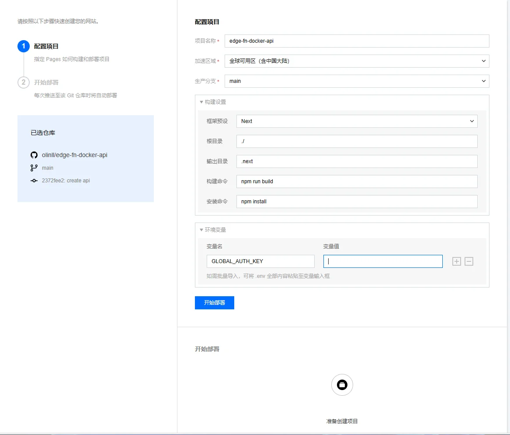
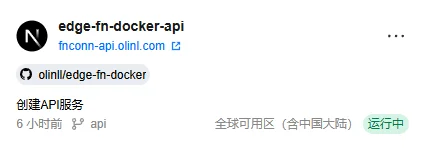
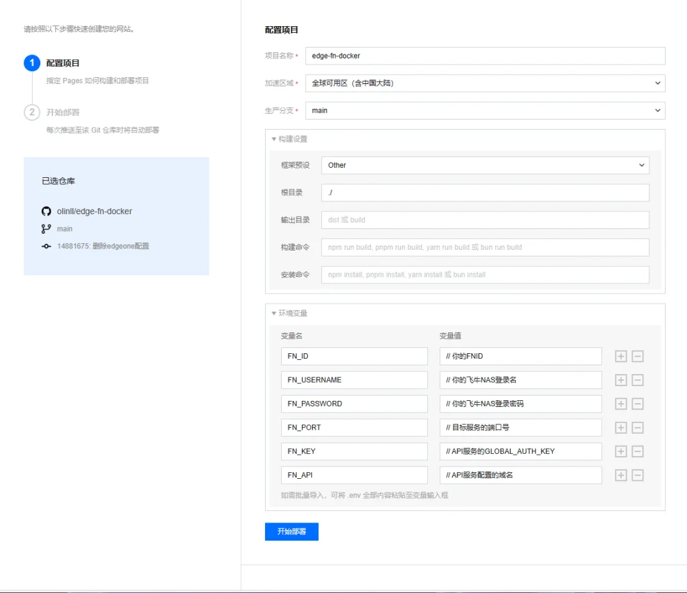
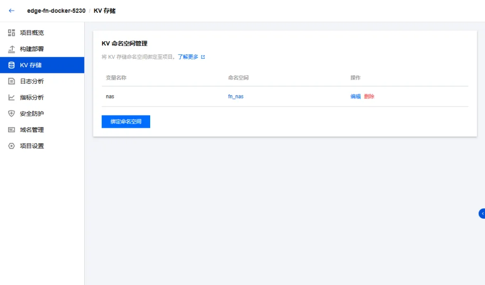

---
title: 利用EdgeOne Pages给飞牛容器一个固定域名
slug: edgeone-fndocker
published: 2025-01-07 00:00:00
updated: 2025-01-07 00:00:00
description: 使用飞牛的Connect服务，提供的临时域名动态反代到EdgeOnePages，为容器提供一个固定域名。
image: api
category: 站点
tags: ["EdgeOne", "飞牛", "容器"]
draft: false
# pinned: false
---

## 写在前面

其原因是看到一个仓库

::github{repo="myflavor/edge-ug-docker"}

该仓库是利用Edge Pages反代绿联的docker代理，实现使用自己的域名直接访问docker端口

那么飞牛的同理，我们也可以使用飞牛的FN Connect服务，为自己的Docker容器端口绑定一个自己的域名，实现上述操作。

> [!NOTE]
> 飞牛API参考仓库
>
> ::github{repo="FNOSP/fnnas-api"}

> [!IMPORTANT]
> 由于飞牛的API使用的是websocket，所以需要一个api服务对外提供查询服务，随后使用一个前端服务对API返回的url地址进行反代。
>
> API项目：
>
> ::github{repo="olinll/edge-fn-docker-api"}
>
> 前端反代项目：
>
> ::github{repo="olinll/edge-fn-docker"}

## 部署

> [!CAUTION]
> 这里事先声明，API只需要部署一套，反代服务可以部署多套
> 例：需要反代 5432、8080、9001，那么你就部署3个反代服务，分别配置不同的环境变量即可！

首先Fork我的两个项目，打开腾讯EdgeOne Pages页面，部署API服务

## API服务

选择main分支，构建设置默认即可，配置环境变量`GLOBAL_AUTH_KEY` 为一个随机值，用于后续访问的鉴权密钥。



点击开始部署，然后添加一个**自定义域名并且配置HTTPS**

> [!NOTE]
> PS：配置eo提供的域名需要token访问且只能维持3小时，所以这里需要使用自定义的域名。
>
> 添加域名的方法可参考腾讯云配置，这里不做太多赘述。
>
> eo控制台->添加域名-> 根据选择的方式进行验证域名-> 配置pages自定义域名-> 去域名托管商配置上生成的cname记录-> 配置https -> 等待生效

Pages主界面显示运行中，**API服务**部署完成，下面开始部署反代页面



## 反代服务

首先创建项目，选择你fork的edge-fn-docker仓库，生产分支main
然后配置环境变量（可以直接复制进去填写变量值）

```sql
FN_ID=           // 你的FNID
FN_USERNAME=  // 你的飞牛NAS登录名
FN_PASSWORD=  // 你的飞牛NAS登录密码
FN_PORT=          // 目标服务的端口号
FN_KEY=          // API服务的GLOBAL_AUTH_KEY
FN_API=          // API服务配置的域名
```

> [!CAUTION]
> 这里一定要在飞牛创建一个管理员用户去使用，一定不要使用默认的管理员用户。
>
> ！！！以防一些未知问题导致用户密码错误次数过多被封禁！！！
>
> ！！！以防一些未知问题！！！

最终配置如图



点击开始部署，等待部署完成，使用上面的方式绑定自己的自定义域名。
**创建KV存储**
1、点击pages下面的KV存储，创建一个命名空间，这里可以随便命名
2、找到你的反代服务(就是edge-fn-docker)，点击KV存储，绑定命名空间，变量名称填写`nas`，绑定上面创建的命名空间。
创建完成如图所示
 最后，打开你绑定的服务域名，即可访问飞牛NAS上的服务。

## 写在最后

如果出现访问出错，请检查上述配置是否正确，填写的环境变量是否出错！
如果配置无误，请检查你的FN Connect服务是否能正常打开，如无法打开，请登录飞牛，开关FN Connect开关进行重启服务。
_其他问题请联系作者。_
**免责声明**
如果此仓库违反了飞牛私有云用户协议，请联系我此篇文章和相关仓库。

## 编辑建议

> 以下建议基于本条目内容生成，仅供发布前参考。

### 文章内容建议
- 建议补充"## 反代服务"配置环境变量后**前端项目 Fork 后需要同步修改的位置**（Vite/Next 默认 `BASE_URL`、API 地址等），目前只给环境变量清单，读者不知道代码层还要改什么。
- 建议补充"安全性强化"小节：当前使用 `FN_PASSWORD` 走明文环境变量存在泄露风险，建议补充 1Password CLI 注入 / 腾讯云密钥管理系统接入 / FN Connect 单独创建只读子账号等方案。
- 建议补充"多端口批量反代"小节：第六章 caveat 中提到"反代服务可部署多套"，但没给具体的"同一项目内通过 KV 配置多个端口"或"多 Pages 项目"对比方案；建议展开。
- 建议补充"## 写在最后"中的"其他问题请联系作者"前给一个完整的 self-debug 清单（检查环境变量、检查 FN Connect 状态、检查 KV 绑定），避免作者成为瓶颈。

### 修改建议
- 文章标题"利用 EdgeOne Pages 给飞牛容器一个固定域名"长度合理，但与 slug `edgeone-fndocker` 不完全对应（标题突出"飞牛容器"，slug 突出"飞牛 Docker"）；建议二选一统一：要么标题改"EdgeOne Pages + 飞牛 Docker 容器固定域名方案"，要么 slug 改 `edgeone-fn-container`。
- 全文混用 `` markdown 引用语法与 Astro `::github{repo="..."}` 容器，建议统一为一种风格（Astro 容器更站内一致，但 markdown 链接更通用）。
- 第四段"！！！以防一些未知问题导致用户密码错误次数过多被封禁！！！"连续感叹号非常口语，建议改用 `:::caution` 容器或加粗警告，提升可读性。

### 合并建议
- 候选合并对象：`eo-cdn-use`（同 EdgeOne 主题）
- 合并理由：可合并为"EdgeOne 配置实战：CDN 加速 + Pages 反代"系列；或保留独立并在两文末互相加链接。
- 候选合并对象：`frp-deploy`（内网穿透场景）
- 合并理由：飞牛容器 + EdgeOne Pages 实际上是用 CDN 反代替代传统 frp/内网穿透方案，建议在 `frp-deploy` 文末加"## CDN 反代方案 → 跳转 edgeone-fndocker"链接。

### slug 建议
- 当前：`edgeone-fndocker`
- 建议：保留
- 理由：slug 直接命中工具 + 用途（EdgeOne 反代飞牛 Docker），可识别性强；可改为 `edgeone-pages-fn-container-proxy` 更正式但偏长。

### 分类建议
- 建议归类到：网络
- 理由：核心是 CDN 反代实现"无端口访问"，属典型网络主题；当前 `HomeLab 私有云` 涵盖过广。
- 备选：容器（涉及飞牛容器端口暴露）

### tags 建议
- 建议：`[EdgeOne, 飞牛]`
- 与现状对比：`[EdgeOne, 飞牛, 容器]`，差异说明：`容器` 与文章标题"飞牛容器"语义重叠，建议删除以精简；保留 `[EdgeOne, 飞牛]` 两个核心 tag。

### 其他建议
- 建议补充配图：API 服务 Fork 后 Settings 页面环境变量配置截图、反代服务环境变量完整填写后截图、KV 存储命名空间创建步骤截图。
- 建议在文首加"环境依赖"小卡：飞牛 OS 版本（FN Connect API 兼容性变化频繁）、EdgeOne Pages 计划（Pages 免费额度与 KV 存储限制）、作者使用的部署时间。
