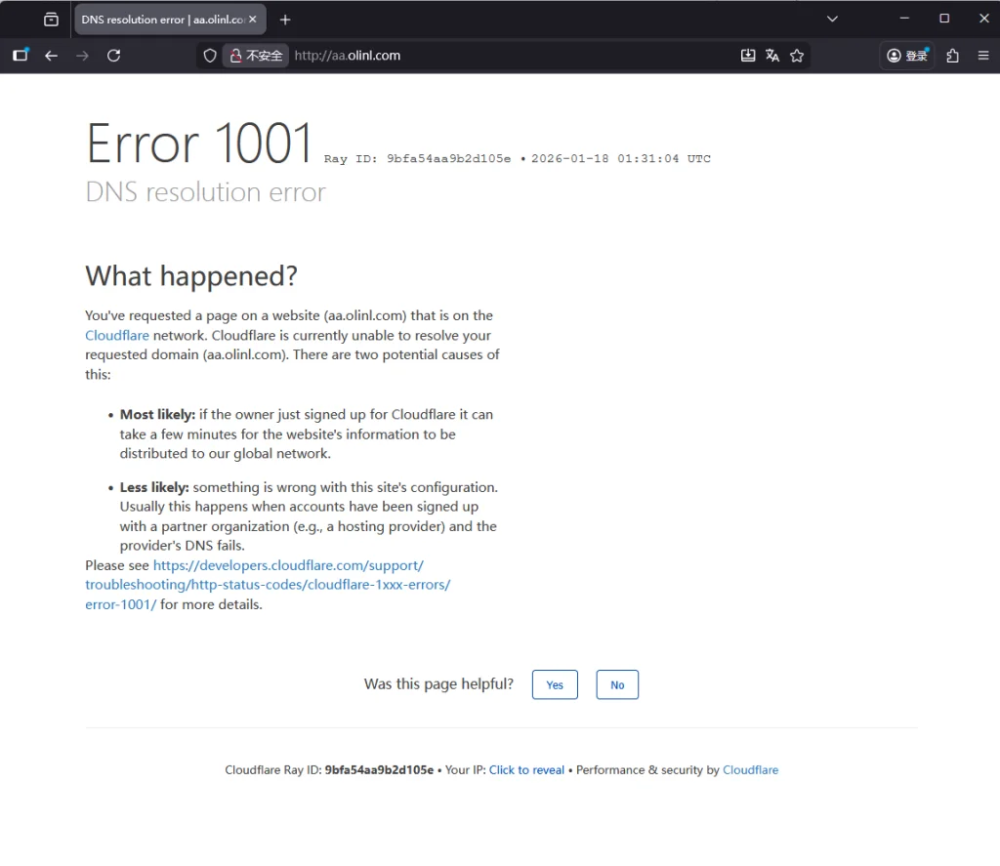
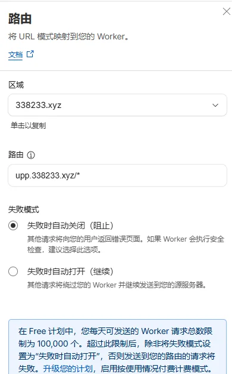
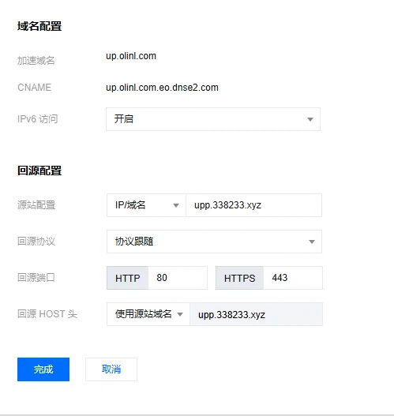
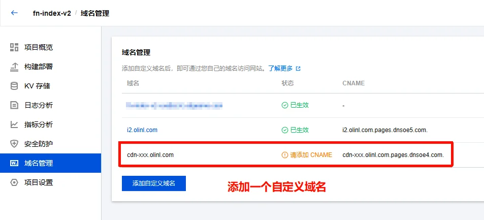
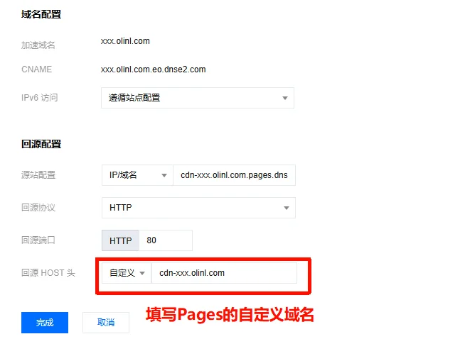
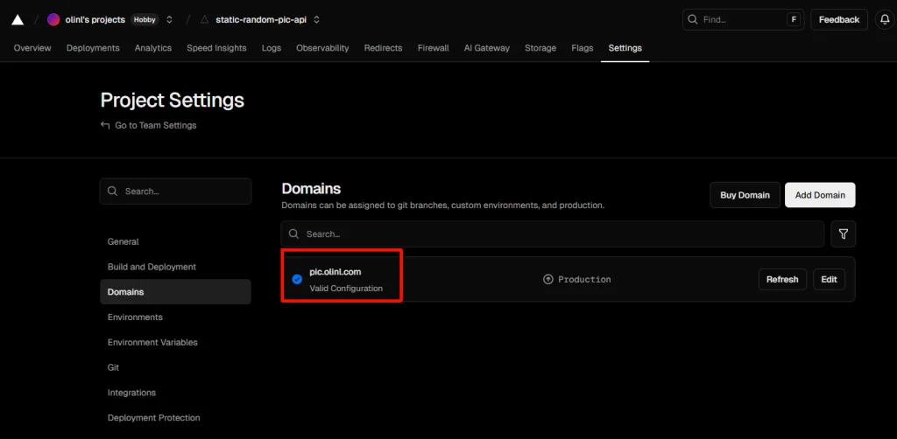
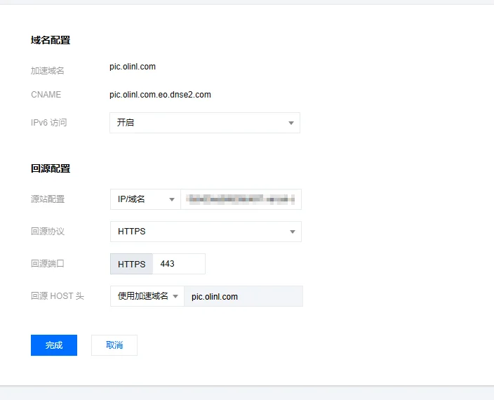
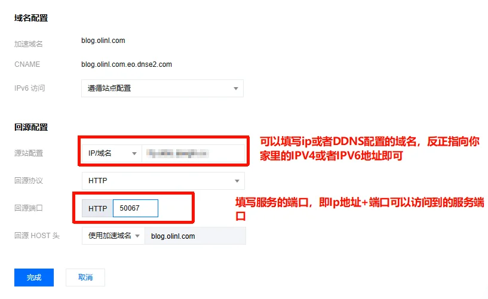

---
title: 使用EdgeOne CDN加速你的任意网站
slug: eo-cdn-use
published: 2025-01-18 00:00:00
updated: 2025-01-18 00:00:00
description: Tencent EdgeOne是一个边缘安全加速平台，腾讯云出品，国内访问延迟极低。今天带大家来看一下他的玩法
image: api
category: 站点
tags: ["EdgeOne", "CDN", "加速"]
draft: false
# pinned: false
---

## 正式开始

对于EdgeOne可加速的站点主要有2种，大部分互联网上可访问的站点都是这2种。

## 静态站点

这类站点是使用Vercel、Github Pages、CloudFlare Pages搭建的静态网页，通常通过Git进行订阅更新，当你推送新内容的时候，服务商会自动的拉取代码，允许CI/CD，自动打包部署上线。

想要让Pages用上EO，其实很简单，只需要把Pages的CNAME值填入到EO 域名的加速站点里面即可。下面教大家如何操作。

## CloudFlare Pages

在你的Pages 添加自定义域，记录提供的CNAME值。

进入EO，你的域名，添加域名，加速域名填写pages的自定义域，源站配置填写上面的CNAME值，协议默认80，回源HOST头选择使用加速域名。

_PS：如果出现下面的问题，那就说明CF的域名必须验证通过，是启用状态才可以。_

因为CF边缘节点的域名并没有通过DNS验证，所以会报错1001，**当然你也可以通过DNS服务商的区域做划分，让国内走EO，国外仍然使用CF。**

这个时候可以先把cf的验证通过，后面再改成EO的CNAME。

## CloudFlare Workers

在你的Workers和Pages->你的项目，设置里面添加一个自定义路由。

然后把这个自定义的路由的域名解析到你的优选域名，或者添加自定义域，总之可以使用这个域名访问到Workers。

最后打开EO，你的域名，添加域名，源站配置填入cf添加的域名，回源HOST头使用源站域名。

## EdgeOne Pages

EO Pages本身就使用的是EO CDN的加速，如果你想要把你的Pages服务添加进你的加速域名里面进行统一管理，可以参考下面配置。

在Pages域名管理，添加一个自定义的域名，例如cdn-xxx.olinl.com。记录CNAME值，不需要做CNAME解析。

在你的域名，域名管理里面，添加一个加速域名，xxx.olinl.com（最终用户访问的域名），源站配置填写上面的CNAME，协议使用HTTP 80，回源HOST头自定义为cdn-xxx.olinl.com（Pages自定义域名）。

原理：当用户通过最终访问的域名访问时，会携带着回源自定义HOST头（cdn-xxx.olinl.com），到CANEM的Pages服务。

> [!CAUTION]
> CNAME 接入方式默认使用 HTTP（80 端口）回源，不支持 HTTPS。如需 HTTPS 访问，请使用其他接入方式。

这里要注意的是：CNAME默认是HTTP，就是80访问，不支持HTTPS。

## Vercel

在你的项目-> Domains 添加一个自定义域名，和最终访问的域名一致，记录CNAME值，仍然不需要解析CNAME。

EO你的域名，添加域名，源站配置填写Vercel CNAME值，回源协议HTTPS 443，回源HOST头要和Vercel配置的域名一致，然后正常解析EO给你的CNAME值。等待配置完成即可访问。

# 动态站点

这里统称为部署在服务器上的站点需要加速。

添加域名，填写加速域名（用户最终访问的域名），源站配置填写服务器的ip，或者其他需要加速的域名，回源协议根据情况填写，如果没有ssl证书那就仅HTTP，端口也是，回源HOST头默认使用加速域名。

这里也可以直接将家用宽带的IPV6带宽带访问的服务加速成不带端口的，并加上防护和cdn。

参考如下：

## 编辑建议

> 以下建议基于本条目内容生成，仅供发布前参考。

### 文章内容建议
- 建议补充"## 动态站点"前的过渡段：当前 markdown 缺少二级标题"## 动态站点"（行 77 直接以 `# 动态站点` 一级标题出现，与前文结构脱节），建议修正为 `## 动态站点` 并补一两句"相对静态站点，动态站点的加速配置差异主要在源站协议与回源 HOST 头"。
- 建议补充"## 缓存策略"小节：CDN 加速核心是缓存规则配置（按目录/后缀/参数 key 缓存），本文完全没提 EdgeOne 的"缓存规则 / 缓存键"配置位置，读者配置完发现"每次都回源"不知道在哪改。
- 建议补充"## HTTPS 证书"小节：CNAME 模式不支持 HTTPS（已在文中 caveat 说明），但如何切换到 HTTPS 接入模式（自有证书上传 / EdgeOne 申请免费证书）应该展开讲，否则读者遇到 HTTPS 需求会卡住。
- 建议补充"## 安全防护"小节：EdgeOne 卖点是"边缘安全加速"，WAF / Bot 防御 / CC 防护 / 区域封禁等核心能力在本文完全没体现，与 description 中"边缘安全加速平台"不匹配。

### 修改建议
- 文首 description 写"今天带大家来看一下他的玩法"过于口语化，建议改为"使用腾讯云 EdgeOne 加速 CloudFlare Pages、Workers、Vercel 等静态站点及家用 NAS 等动态源站"。
- 全文分类 `服务与应用运维` 与新的 7 分类不匹配，文中涉及 CDN 加速属典型"网络"类；建议改为"网络"分类。
- 文中大量使用"PS"开头的行内注释（行 30、34、65），建议统一为 `> **提示：**` 引用块或 `:::tip` 容器，提升可读性。

### 合并建议
- 候选合并对象：`edgeone-fndocker`（同 EdgeOne 系列）
- 合并理由：两文都是 EdgeOne 配置教程，可合并为"EdgeOne 配置实战"系列；或保留独立但在两文末互相加"## 相关阅读"链接。
- 候选合并对象：`cf-fastip`（CDN 加速 + CloudFlare 主题）
- 合并理由：两文都涉及 CloudFlare + 国内访问加速，可在 eo-cdn-use 文末加"## 国内访问 CloudFlare 站点的另一思路 → 跳转 cf-fastip"链接。

### slug 建议
- 当前：`eo-cdn-use`
- 建议：保留
- 理由：slug 简洁且命中 EdgeOne 缩写（eo）+ 用途（use）；可改为 `edgeone-cdn-tutorial` 更正式，但当前 slug 已足够识别。

### 分类建议
- 建议归类到：网络
- 理由：CDN 加速属典型网络主题；当前 `服务与应用运维` 与新的 7 分类不匹配。

### tags 建议
- 建议：`[EdgeOne, CDN]`
- 与现状对比：`[EdgeOne, CDN, 加速]`，差异说明：`加速` 主题词与 `CDN` 语义重叠（CDN 本身就是加速），建议删除以精简；保留 `[EdgeOne, CDN]` 两个核心 tag。

### 其他建议
- 建议补充配图：文章已有 8 张截图但都集中在 CloudFlare/Vercel 接入部分，EdgeOne Pages 接入、动态站点接入缺配图；建议补一张"EdgeOne 控制台加速域名列表"截图和"## 缓存规则配置"截图。
- 建议在文首加"最后更新于 YYYY-MM"标注，因为 EdgeOne 控制台 UI 改版频繁（套餐、域名管理路径、规则引擎位置都变过），无版本标注读者按图索骥容易找不到。
