---
title: 「适用于小白」Firefly 博客部署教程
slug: firefly-first
published: 2026-06-18 18:45:13
updated: 2026-06-12 15:46:00
description: 手把手带你搭建一个静态的博客网站。
image: api
category: 部署
tags: [搭建, Cloudflare]
draft: false
# pinned: false                                  # 置顶
---

<iframe width="100%" height="468"
  src="//player.bilibili.com/player.html?bvid=BV17Njb6nEH8&p=1&autoplay=0"
  scrolling="no" border="0" frameborder="no"
  framespacing="0" allowfullscreen="true">
</iframe>

## 一、前置准备

你是否想拥有一个属于自己的博客，却不知道从何下手？  
今天我们将从购买域名开始，一步步教你部署一个静态博客。

> [!NOTE] 什么是静态站点
>
> **传统模式**: 我们需要在服务器上安装相关组件，每次访问都要动态生成页面，消耗服务器CPU。这也是为什么需要买云服务器。
>
> **现代静态模式**：我们只需要把构建生成的静态文件上传到 Vercel、CloudFlare 或 EdgeOne 的全球边缘节点上  
> 当用户访问时，CDN（内容分发网络）直接把这些现成的文件返给浏览器，不需要后端服务器执行任何代码。  
>
> **结论**：“所以，所谓'无服务器'，并不是真的没有物理机器，而是我们不需要去管理、维护、付费买一台专用的云主机。
>
> 我们只需要为文件存储和网络流量付费。对于个人博客，这三家平台提供的免费额度已经完全够用了！”

本篇教程适用于Firefly、Fuwari、Mizuki 等类型的博客。  
涵盖了Cloudflare workers、Vercel、腾讯云Edgeone 3类平台的部署教程。

> [!CAUTION] 注意
>
> 部分情况可能需要特殊的网络环境，如无法正常访问请尝试更换网络环境。

### 安装必备环境

- [Node.js](https://nodejs.org/)：关键运行环境
- pnpm：包管理工具，使用npm进行安装。
- [Git](https://git-scm.cn/)：版本控制，用于拉取、提交代码。
- [GitHub Desktop](https://desktop.github.com) github官方客户端
- [VS Code](https://code.visualstudio.com)：编辑器，用于修改配置、写文章。

#### 安装Node.js

这里推荐安装**LTS**稳定版，版本需要 ≥ 22

可以点击链接进行下载：[Node.js v24.17.0 LTS](https://nodejs.org/dist/v24.17.0/node-v24.17.0-x64.msi)

或者打开下载页面手动下载：https://nodejs.org/zh-cn/download

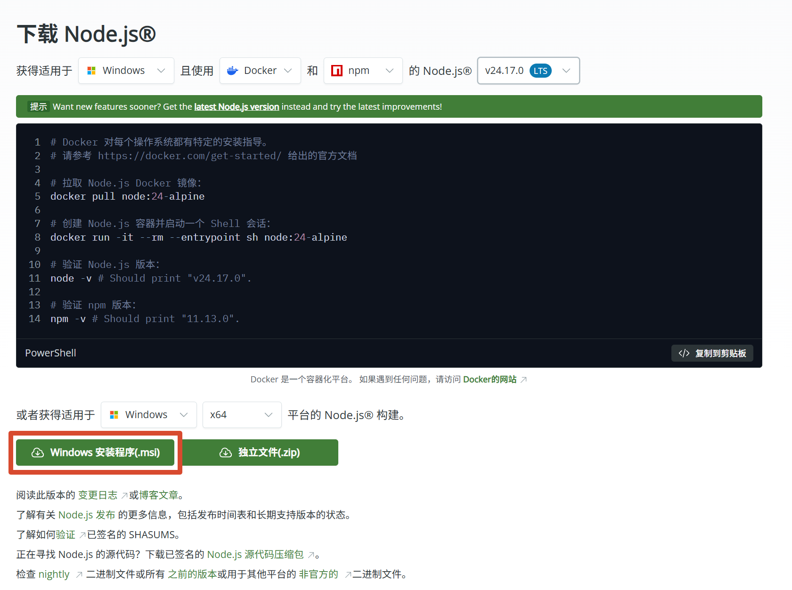

下载完成后进行安装，默认选项直接下一步即可。随后我们打开`终端`窗口，执行以下命令验证版本号是否正确

```bash
node -v
npm -v
```

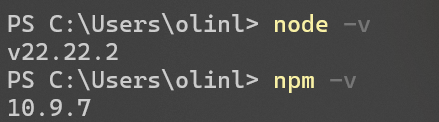

**注意**：安装后重启终端，无效则重启电脑。

#### 安装pnpm

```bash
npm install -g pnpm

# 随后执行如下命令进行验证
pnpm -v
```

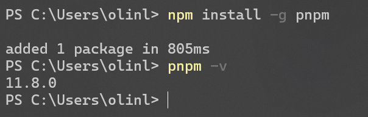

#### 安装 Git

访问 [下载页面](https://git-scm.cn/install/windows)，下载最新版并默认安装

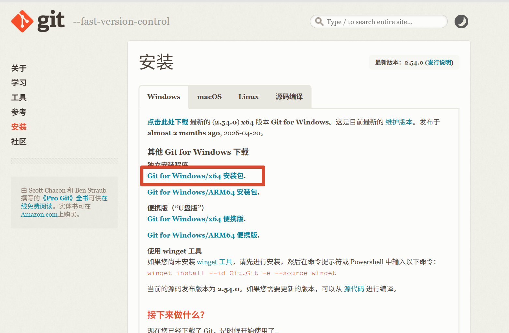

#### 安装Github Desktop


点击访问：[下载页面](https://desktop.github.com/download/) 点击进行下载

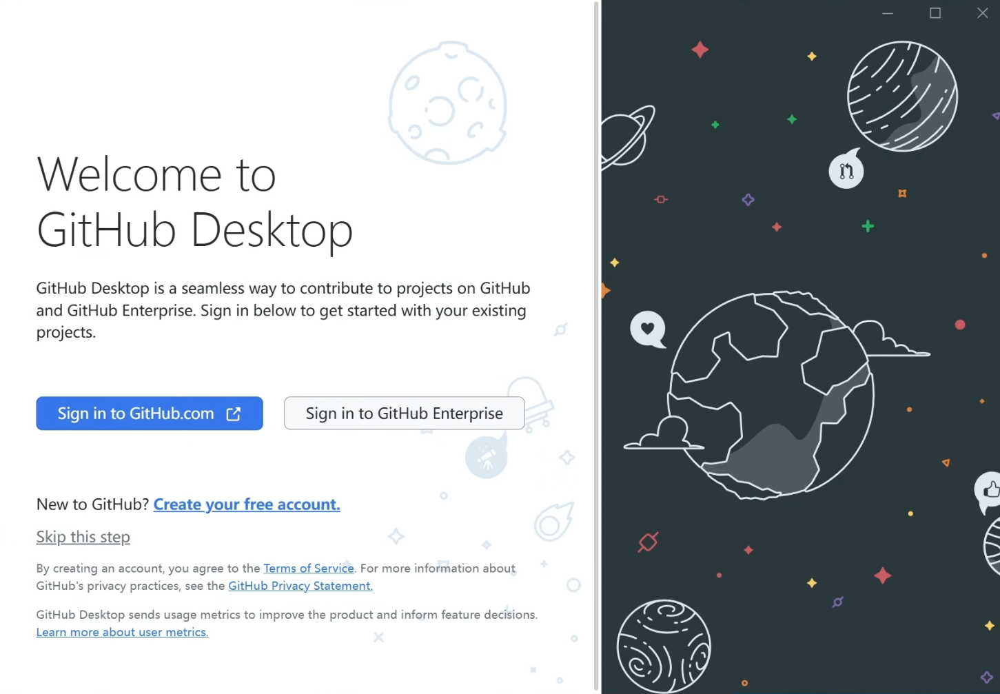


#### 安装VS Code

如果您有更好的编辑器，可以安装其他的。

点击访问：[下载页面](https://code.visualstudio.com/Download) 选择您的系统进行下载

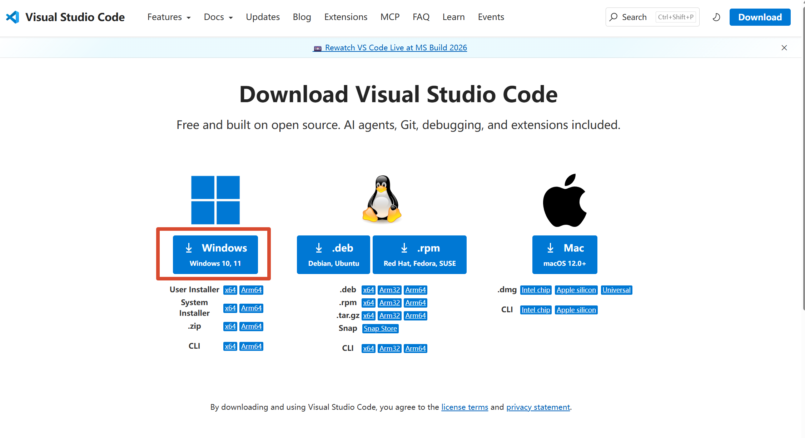

随后进行安装即可。

## 二、Fork Firefly 官方仓库

打开Firefly官方仓库：

::github{repo="CuteLeaf/Firefly"}

点击右上角的「Fork」按钮。

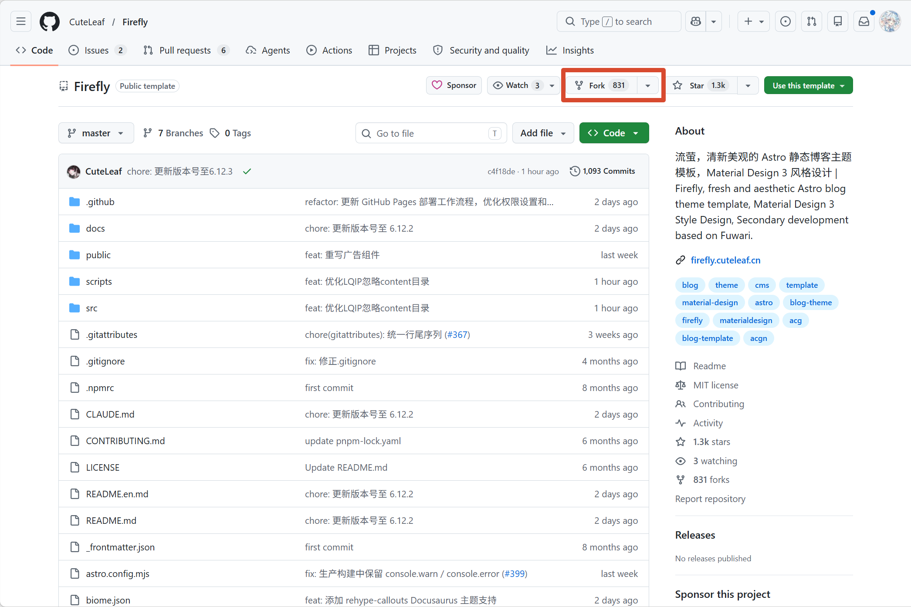

填写信息后，点击「Create Fork」后，会自动跳转到你自己的仓库。

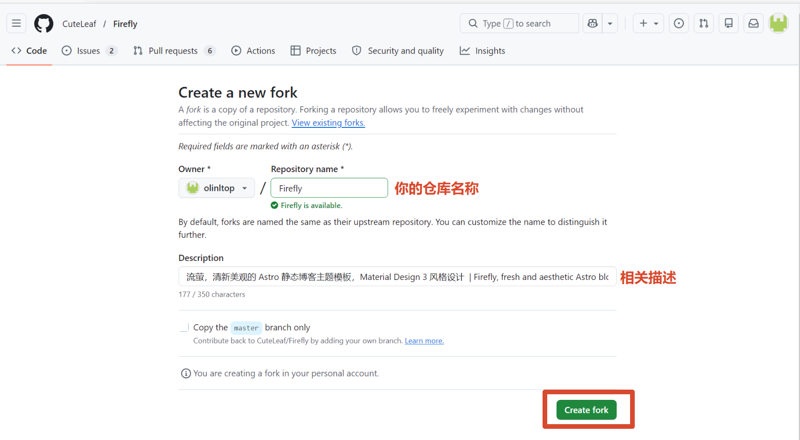

## 三、克隆仓库并修改配置

现在我们已经拥有了Firefly 仓库，需要将它的代码克隆到本地，进行修改配置，编写文档等。


### 克隆并本地运行

我们打开GitHub Desktop 搜索Firefly 点击下方的Clone 按钮 拉取代码  
然后选择一个本地的目录存储。

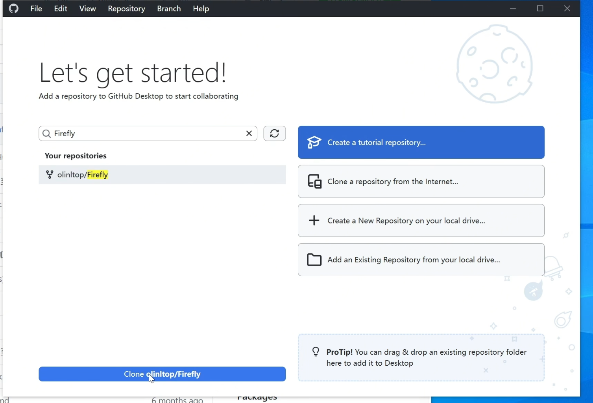

然后右键项目目录，通过code打开。

点击顶部的`终端` `新建终端`，然后在新打开的终端输入下面的命令进行安装依赖

```bash
pnpm install
```
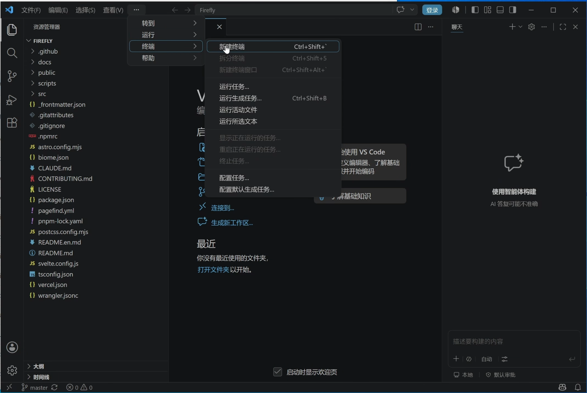


**启动本地预览**

```bash
pnpm dev
```

等待10\-30秒，终端显示访问地址：    [http://localhost:4321](http://localhost:4321)

打开浏览器输入该地址，看到Firefly默认首页，即本地搭建成功。

### 修改关键配置


点击左侧目录树，配置文件夹：`src/config/`

这里可以根据官网文档自定义你的站点：https://docs-firefly.cuteleaf.cn/zh/guide/site.html


### 如何编写文章


点击左侧目录树，文章文件夹：`src/content/posts/`

文章使用[Markdown](https://markdown.com.cn/basic-syntax/index.html) 格式 

最上面是文章的属性信息,定义文章的标题，发布日期等等。

具体可以参考官网文档：https://docs-firefly.cuteleaf.cn/zh/guide/writing.html

### 上传Github

我们在修改完配置，编写完文章后，要将相关的代码上传到GitHub，这里使用Git工具上传，有2种方式，

1、Github Desktop

我们在GitHub Desktop 勾选需要提交的文件，在下面输入提交消息，然后点击`commit` 按钮 然后点击上方的`Psuh origin`

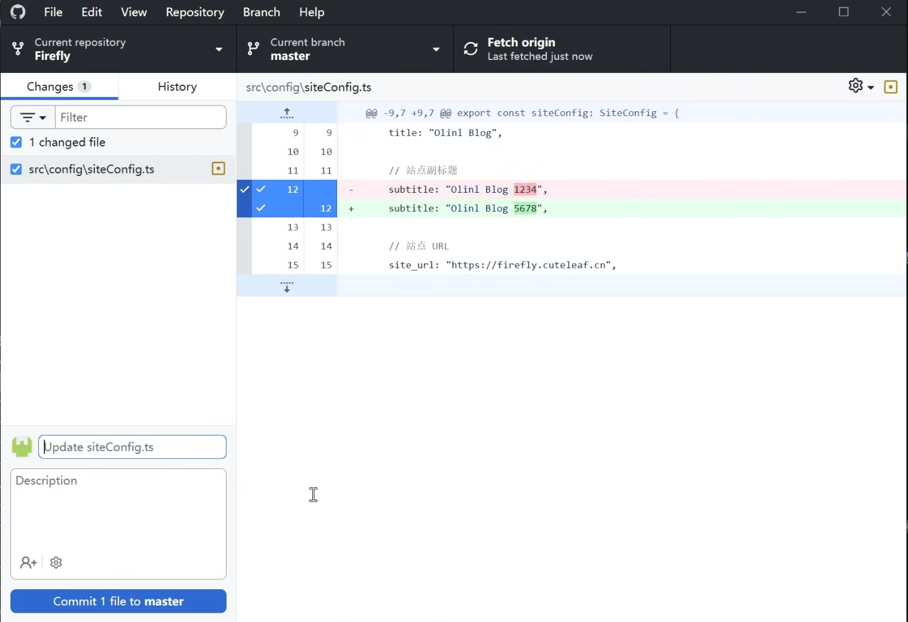


2、使用VS Code

VS Code 左侧有一个源代码管理，在这里可以上传代码，写消息，查看历史变更等。

只需要右键需要提交的文件，点击添加到暂存更改，填入消息之后点击提交按钮，随后点击推送，即可成功推送。

当然，我们也可以直接填入消息之后点击提交，然后点击推送，将所有更改的文件进行提交。

3、或者，我们也可以使用git命令

```bash
# 将文件添加到暂存区
git add . 

# 将暂存区的文件提交到本地仓库
git commit -m "更新内容" 

# 将本地提交推送到远程仓库
git push
```

## 四、部署站点

上面我们已经把自己的代码同步到了GitHub，我们需要让部署程序去关联 GitHub，并自动构建部署，发布到互联网。

这里提供了3种方式，Cloudflare Workers、Vercel、腾讯EdgeOne

> 这三种有什么特点
>
> Cloudflare Workers 通吃，绑定域名无需备案，可以实现优选加速访问等等。
>
> Vercel 优点是部署快速，而且提供的域名可以实现国内访问，不像Cloudflare存在SNI封锁的问题
> 
> 腾讯Edgeone 优点是国内的大牌CDN，国内访问特别迅速，缺点是域名必须备案。

> [!NOTE] 提示
> 如果你的站点已经过了ICP或者ICP+公安网备，那么这里推荐使用EdgeOne对你的站点进行加速。  
>
> 因为根据SNI封禁策略，ICP备案的站点访问速度会比正常的站点要快。  
>
> 你无需担心监管问题，因为公安网信办会定期检查你的网站有无违规，是否正常访问。

### 部署到Cloudfare Workers

#### 检查配置文件

由于我们是要部署到 Cloudflare，需要确保项目里的 Worker 配置文件正确。

在项目根目录找到 `wrangler.jsonc`，确认内容大致如下（**如果项目已自带，无需新建**）：

```jsonc
{
	"name": "firefly",
	"compatibility_date": "2025-01-01",
	"compatibility_flags": ["nodejs_compat"],
	"assets": {
		"directory": "./dist"
	}
}
```

> [!NOTE] 注意
>
> `name` 修改为你的Worker项目名称

#### 新建 Cloudflare Worker 应用

1. **登录 Cloudflare 控制台** 打开浏览器访问官方控制台：[https://dash.cloudflare.com/](https://dash.cloudflare.com/)，输入账号密码完成登录。
2. **进入 Workers & Pages 页面** 登录后，在左侧菜单栏找到并点击 **Workers 和 Pages**（英文对应：Workers & Pages），进入应用管理页面。
3. **创建应用程序** 在页面右上角，点击 **创建应用程序**（英文对应：Create application），进入应用创建流程。
4. **关联 GitHub 代码仓库** 在创建页面中，选择 **连接到 Git（Connect Git）**，然后选中 **GitHub**，按照页面提示完成授权，允许 Cloudflare 访问你的 GitHub 账号。
5. **选择目标仓库** 授权完成后，系统会列出你的 GitHub 所有仓库，从中选中需要部署到 Cloudflare Worker 的代码仓库（如 Firefly 仓库）。
6. **配置构建设置** ：

- **Build command**: `pnpm build`
- **Deploy command**: `npx wrangler deploy`    

1. **发起首次部署** 配置完成后，点击页面底部的 **部署（Deploy）**，启动首次自动部署流程。
2. **等待自动构建完成** Cloudflare 会自动执行三个操作：拉取 GitHub 仓库代码 → 执行构建命令 → 将项目部署至 Workers 服务器，耐心等待即可。。

#### 验证自动部署是否成功

1. 当构建状态显示“成功”后，点击 Worker 项目顶部的 **临时域名**（格式为：`xxx.workers.dev`）。

2. 打开浏览器访问该临时域名，若页面展示效果与本地预览的博客首页完全一致，说明 Cloudflare Worker 与 GitHub 自动部署配置成功。

#### 绑定域名

因为Worker提供的域名，在国内SNI封禁的情况下可能会无法访问。所以，我们需要绑定一个自己的域名。

2种方式

1. 你的域名托管在Cloudflare，那么你可以直接在Worker 的 domains 绑定你的域名。
2. 如果你的域名不在Cloudflare，那么你需要把你的托管到Cloudflare去使用。

**将域名托管到Cloudflare**

点击域名-> 连接域名，添加你的域名，然后根据提示修改dns服务器地址。

随后点击到worker 里面，绑定你的域名。

#### 验证是否成功

在浏览器打开你的域名后成功访问即可。

#### Cloudflare Worker 域名优选

> [!NOTE] 提示
>
> 本节只复述操作过程，如果你想了解更多，可以前往：[使用CloudFlare优选任何网站！](/posts/cf-fastip/) 了解更多。

**首先我们创建一条这样的记录**


- 名称：可自定义，
- 类型：CNAME
- 内容：*.cf.090227.xyz 其中 * 支持任意字母，例如 youxuan.cf.090227.xyz
- 代理状态：仅DNS 关闭小黄云

> [!NOTE] CF小黄云
>
> cf小黄云指的就是这里的代理状态。
>
> 因为Cloudflare的节点都在国外，所以这个小黄云在你不会用的情况下，不要开启，否则会成为国内的减速器！

**创建Worker 路由**

到Worker 里面，点击域，点击添加路由

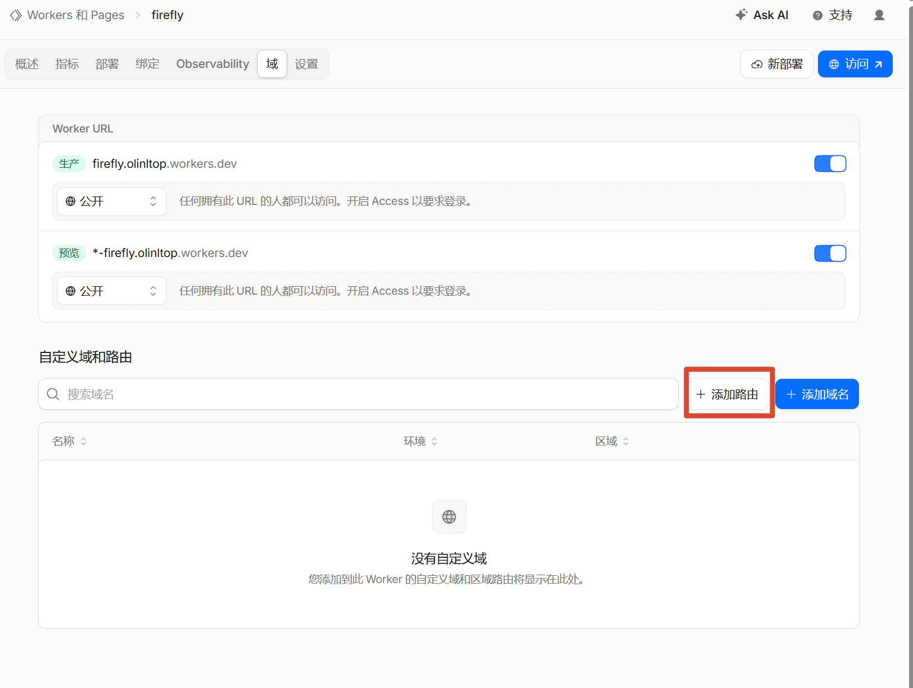

然后选择你的域名，随后填写最终访问的域名+/*

例如：访问的域名 blog.example.com  那么我们就填写 blog.example.com/*

**创建DNS解析记录**

到域名的DNS记录里面，添加一条记录

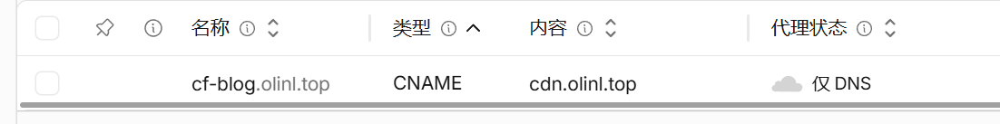

- 名称：Worker的路由前缀，如果你填写是：blog.example.com/* 那么就在这里填写 blog
- 类型:CNAME
- 内容：上面创建的优选域名，本篇是cdn.olinl.top 如果你修改了，那么就按照你修改后的来  
请注意！这里的olinl.top 是我的域名，不要填错了，请填写cdn.xxx 你自己的域名！
- 代理状态：仅DNS 关闭小黄云

最后，我们来检查一下：

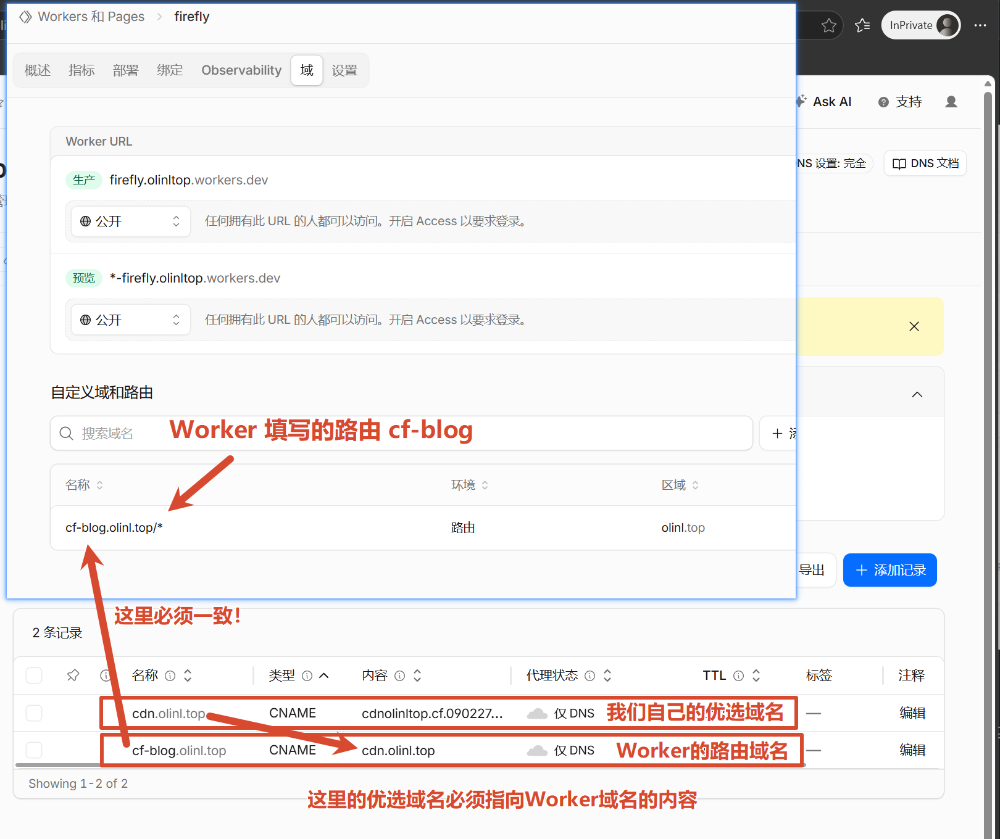

1. 优选域名配置，内容必须是*.cf.090227.xyz 格式，且关闭小黄云
2. Worker 路由，必须是 <前缀>.<你的域名>/* 这个格式
3. Worker DNS记录：名称必须和 Worker路由保持一致，内容必须是1. 配置的优选域名，且关闭小黄云

然后就可以打开配置的域名去访问了。

### 部署到Vercel

打开[Vercel](https://vercel.com/)并登录，进入控制台，点击`Add New...` 绑定你的Gtihub账号，选择需要部署的仓库，点击 `import`。

随后再次点击`Deploy` 开始部署即可。

部署完成后，我们可以在 `Domains` 查看Vercel给我们生成的域名，这个域名可以作为长期域名使用，国内也可以访问。

当然我们也可以在`Domains`选项卡绑定自己的域名。

### 部署到 腾讯云EdgeOne

#### 开始部署

打开[腾讯云 边缘安全加速EO - Makers](https://console.cloud.tencent.com/edgeone/makers)，点击创建项目，导入Git仓库，选择需要部署的仓库。

修改名称为小写字母，然后直接点击开始部署即可。

部署成功后，我们可以点击`域名管理` 然后点击临时域名进行访问。  
~~有些小聪明想要借助这个临时域名进行跳过备案访问，不好意思，这个临时域名是带时间戳的，超时或不带时间戳token访问会弹401~~

#### 绑定域名并签发SSL证书

在`域名管理`添加我们已备案的域名，然后根据CNAME去我们的域名托管商配置CNAME记录，如下图！

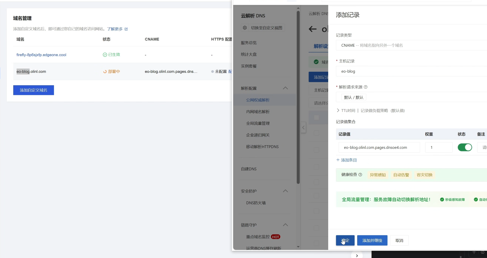

- 主机记录填写你域名的前缀
- 类型选择CNAME
- 记录值填写腾讯云给你的记录


配置成功之后，我们点击HTTP配置下面的`配置`按钮，点击`边缘HTTPS证书`下面的`配置`按钮，然后选择`申请免费证书`。然后点击保存即可。  
在我们配置完CNAME之后，他会自动申请ssl证书，并且到期之前腾讯云会续签，你无需担心SSL证书到期问题。

等待配置状态正常后，访问站点。