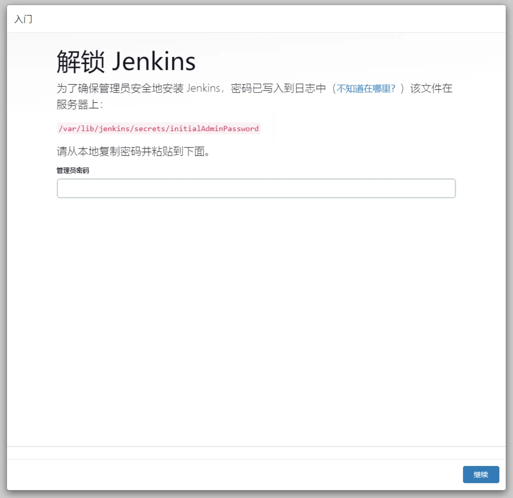
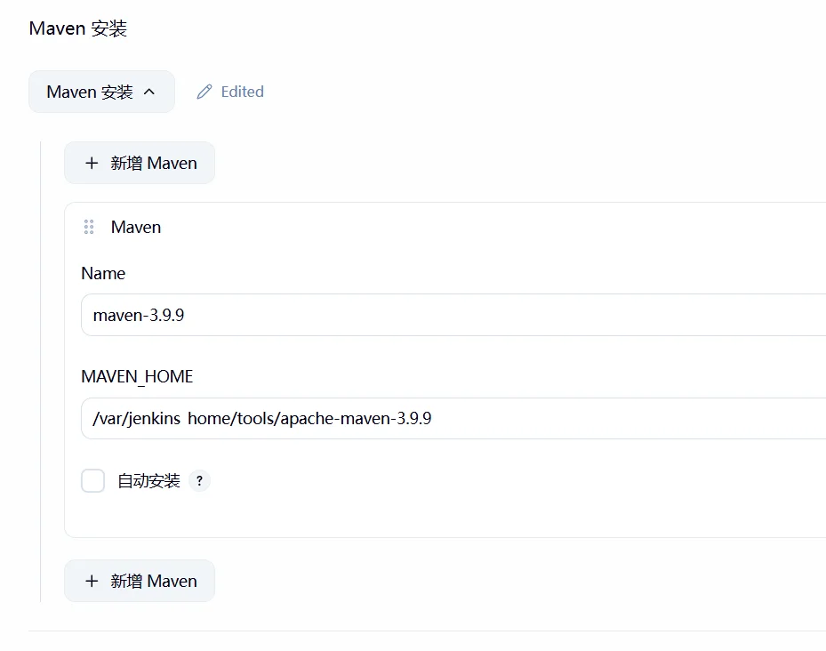
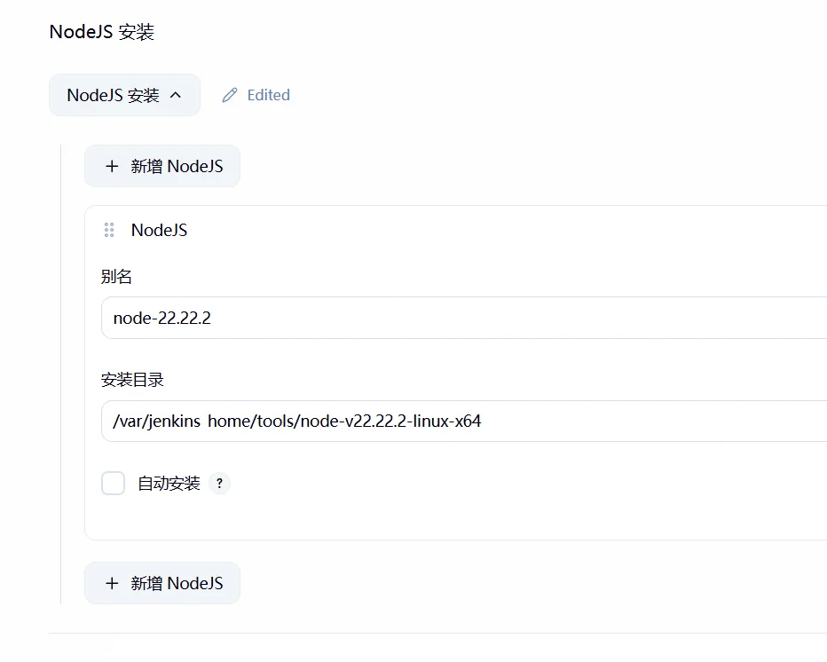
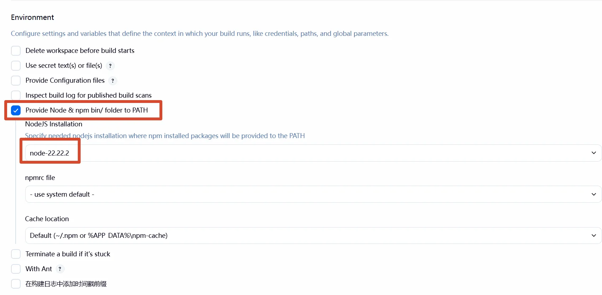
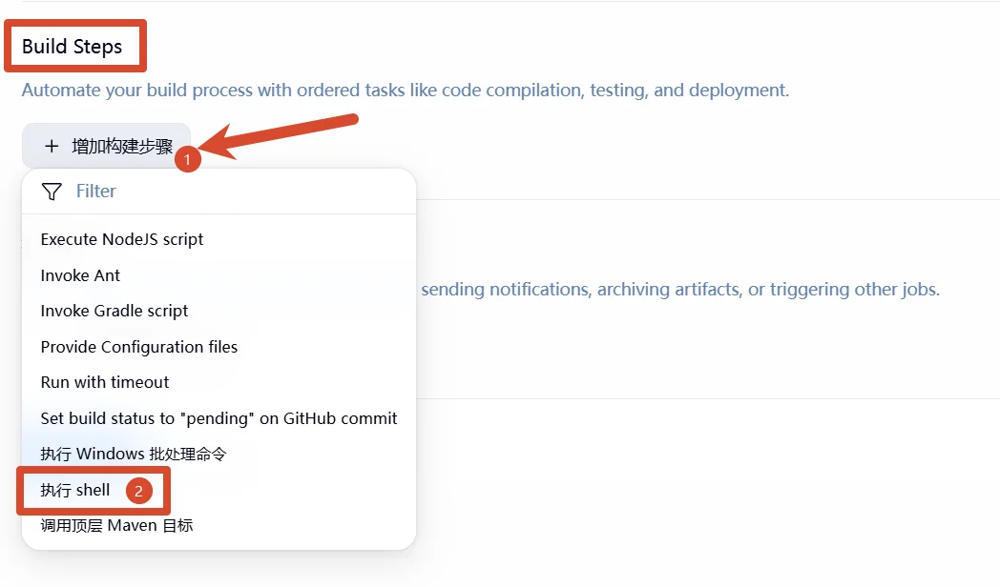
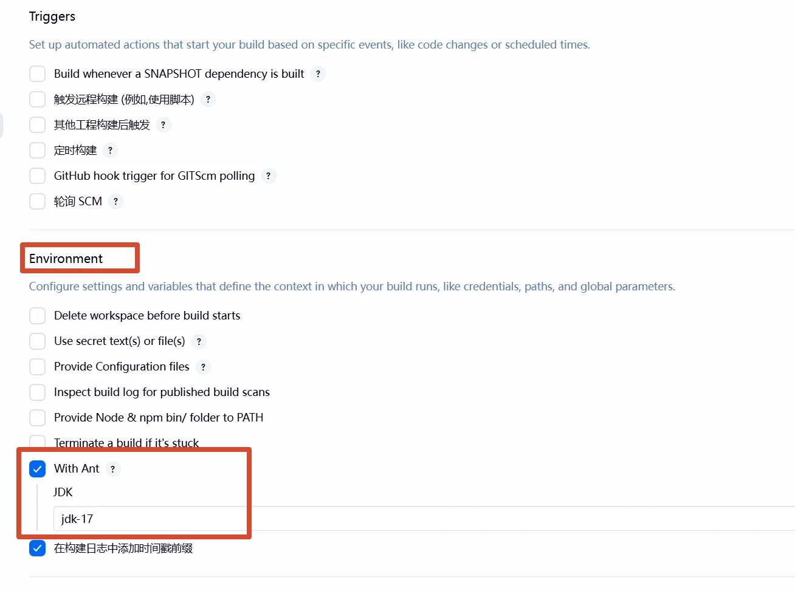
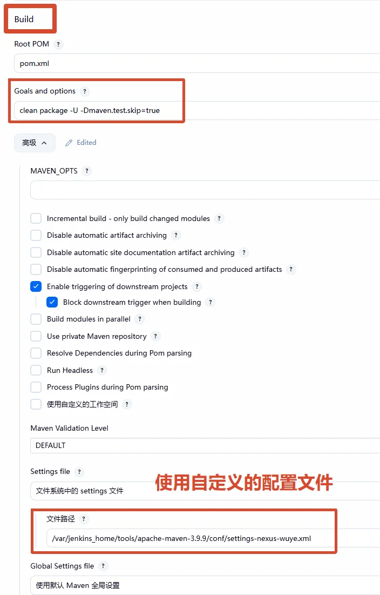

---
title: CI/CD 手册：Jenkins 自动化发布全流程
slug: jenkins-deploy-nodejs-springboot
published: 2025-03-30 00:00:00
updated: 2025-03-30 00:00:00
description: 详细记录如何通过 Jenkins 搭建自动化流水线，实现 Node.js 前端项目与 Spring Boot 后端项目的打包、上传及一键部署。
image: ./images/0001.webp
category: 中间件
tags: ["Jenkins", "Node.js", "Spring Boot", "运维"]
draft: false
# pinned: false
---

## 一、部署 Jenkins

Jenkins 有两种安装方式：

- **组件方式**：直接安装在宿主机或虚拟机上，适合对环境隔离要求不高的场景。
- **Docker 方式**：容器化部署，迁移方便，推荐优先选择。

本文以 Docker 方式为主，使用 `docker-compose` 管理容器配置。

### Docker Compose 配置

```yaml
services:
  jenkins:
    image: jenkins/jenkins:lts       # 使用最新长期维护版本
    container_name: jenkins-docker
    restart: always
    privileged: true                  # 允许容器内调用宿主机 Docker
    user: root                        # 避免挂载目录权限问题
    ports:
      - "9001:8080"                   # Web UI 访问端口
      - "50000:50000"                 # Agent 节点连接端口
    volumes:
      - ./jenkins_home:/var/jenkins_home          # Jenkins 数据持久化
      - ./web_home:/web_home                      # 前端构建产物目录
      - /var/run/docker.sock:/var/run/docker.sock # 挂载宿主机 Docker Socket
      - /usr/bin/docker:/usr/bin/docker           # 挂载宿主机 Docker 命令
    environment:
      - TZ=Asia/Shanghai
```

> 如果因网络限制无法拉取镜像，请自行配置 Docker 镜像加速地址。

### 获取初始密码

容器启动后，访问 `http://<服务器IP>:9001` 进入初始化向导。初始管理员密码可通过以下命令获取：

```bash
# 在宿主机上直接读取（推荐）
cat jenkins_home/secrets/initialAdminPassword

# 通过 docker exec 读取
docker exec -it jenkins-docker cat /var/jenkins_home/secrets/initialAdminPassword
```



## 二、配置运行环境

Jenkins 本身只是一个调度框架，真正编译代码需要配置对应的工具链。

### 安装必要插件

进入 `Manage Jenkins` → `Plugins` → `Available plugins`，搜索并安装以下插件：

- **NodeJS Plugin**：提供 Node.js / npm 编译环境
- **Maven Integration**：提供 Maven 构建支持
- **SSH Pipeline Steps** 或 **Publish Over SSH**：用于将构建产物推送到远程服务器

### 配置 JDK / Maven / Node.js

进入 `Manage Jenkins` → `Global Tool Configuration`，分别配置 JDK、Maven 和 Node.js 的本地路径。**注意不要勾选「自动安装」**，使用预先下载好的本地版本，避免因网络问题导致构建失败。

各工具的推荐下载地址：

```bash
# JDK 1.8
https://repo.huaweicloud.com/java/jdk/8u201-b09/jdk-8u201-linux-x64.tar.gz
# JDK 17
https://mirrors.huaweicloud.com/openjdk/17/openjdk-17_linux-x64_bin.tar.gz

# Maven 3.9.9
https://archive.apache.org/dist/maven/maven-3/3.9.9/binaries/apache-maven-3.9.9-bin.tar.gz

# Node.js 22.x
https://nodejs.org/dist/v22.22.2/node-v22.22.2-linux-x64.tar.xz
```

> 更多版本请访问官方镜像站：
> - OpenJDK：https://mirrors.huaweicloud.com/openjdk/
> - Maven 3：https://archive.apache.org/dist/maven/maven-3/
> - Node.js：https://nodejs.org/en/about/previous-releases

> [!NOTE]
> 如需手动安装 JDK 或 Maven 并配置环境变量，参见：

- [Linux 手动安装 JDK 1.8](/posts/jdk-install/)
- [Linux 安装 Maven 并配置私服镜像](/posts/maven-install/)

配置完成后效果如下：






### 添加 Git 凭据

如果源码托管在私有仓库，需要提前配置访问凭据。进入 `Manage Jenkins` → `Credentials`，点击 `Add Credentials`，根据实际情况选择用户名密码或 SSH Key 类型。

> [!CAUTION]
> 凭据（密码、SSH Key、Token）**切勿硬编码**在 Jenkinsfile 或构建脚本中，应统一通过 Jenkins Credentials 管理，在脚本中以变量形式引用，防止敏感信息随代码泄露。

## 三、Job 类型说明

> [!IMPORTANT]
> 对于前后端混合部署场景，强烈推荐使用 **流水线（Pipeline）** 类型，配合 Jenkinsfile 版本化管理部署逻辑，将构建流程纳入 Git 版本控制，便于回滚和团队协作。

Jenkins 提供了多种 Job 类型，根据项目复杂度按需选择：

| 类型 | 定位 | 适用场景 |
|------|------|----------|
| **流水线 (Pipeline)** | 进阶首选 | 前后端混合部署、生产环境、需要版本化管理构建逻辑 |
| **Freestyle project** | 入门级 | 临时脚本、单一 Shell 命令测试 |
| **Maven 项目** | 后端专用 | 纯 Java/Spring Boot 项目，不涉及前端 |
| **多配置项目** | 兼容性测试 | 需要在多个 OS 或 JDK 版本下并行测试 |
| **文件夹 (Folder)** | 任务管理 | Job 数量多时用于分类归档 |
| **多分支流水线** | 高级自动化 | 规范团队开发，自动为各 Git 分支创建独立流水线 |

**流水线**的核心优势在于：流程可视化、脚本可版本化管理，且支持复杂的条件逻辑（例如前端编译失败时自动终止后端发布）。**Freestyle project** 操作简单但配置无法入 Git，逻辑复杂后难以维护。

## 四、部署 Node.js 前端项目

### 创建 Freestyle Job

新建一个 `Freestyle project`，在源码管理中填入 Git 仓库地址。

在 **Environment** 选项卡中，勾选 **Provide Node & npm bin/ folder to PATH**，选择前面配置好的 Node.js 环境。



进入 **Build Steps**，点击「增加构建步骤」，选择 **Execute shell**，填入以下构建脚本。



### 编写构建脚本

以下脚本涵盖依赖安装、打包和产物同步三个阶段，根据实际项目调整变量即可：

```bash
# ---------- 基础配置（按需修改）----------
SOURCE_DIR="dist"          # 打包输出目录（如 dist、build）
TARGET_PATH="/web_home/"   # 宿主机 Nginx 静态文件目录

echo ">>> 阶段 1: 配置镜像源并安装依赖"
npm config set registry https://registry.npmmirror.com
npm install

echo ">>> 阶段 2: 执行构建 (产物目录: ${SOURCE_DIR})"
npm run build

echo ">>> 阶段 3: 同步产物至 Nginx 目录"
if [ -d "${SOURCE_DIR}" ]; then
    echo "确认发现产物目录: ${SOURCE_DIR}"
    mkdir -p ${TARGET_PATH}
    rm -rf ${TARGET_PATH}/*
    cp -r ${SOURCE_DIR}/* ${TARGET_PATH}/
    echo ">>> 发布成功！已同步至 ${TARGET_PATH}"
else
    echo "ERROR: 找不到目录 '${SOURCE_DIR}'，请检查 package.json 中 build 脚本的输出路径。"
    exit 1
fi
```

> [!WARNING]
> `rm -rf ${TARGET_PATH}/*` 会清空目标目录下的所有文件。执行前请务必确认 `TARGET_PATH` 变量赋值正确，避免误删宿主机重要数据。

<!-- TODO: 补充截图 ./images/jenkins-deploy-build-success-console.webp (Node.js 构建成功控制台日志) -->

> [!TIP]
> - **依赖缓存慢：** 建议在 Jenkins Node 插件配置中为 npm 全局设置国内镜像源，避免每次构建都重新下载。
- **多环境打包：** 如果有开发、测试、生产等多套环境，打包命令可能是 `npm run build:prod` 或 `npm run build:test`，请根据实际情况修改脚本。
- **Nginx 读取权限：** Jenkins 以 `root` 用户运行，生成的 `dist` 目录权限也是 root。若 Nginx 以非 root 用户运行，需在脚本末尾追加 `chmod -R 755 ${TARGET_PATH}` 确保读取权限。

### 进阶：Node.js 项目的 Pipeline 实现

如果你厌倦了在网页上点点点，可以使用 Pipeline 脚本。它的优势在于：哪怕 Jenkins 挂了，你的构建逻辑依然保存在代码仓库里。

```groovy
// 在 Jenkinsfile 或 Pipeline 脚本中填入
pipeline {
    agent any
    environment {
        // 必须对应“全局工具配置”中的名称
        NODE_HOME = tool 'node22' 
        WEB_HOME  = "/web_home"
    }
    stages {
        stage('环境准备与安装') {
            steps {
                // 使用 withEnv 正确注入 PATH，直接赋值 PATH 在 Pipeline 中不生效
                withEnv(["PATH+NODE=${NODE_HOME}/bin"]) {
                    sh "npm config set registry https://registry.npmmirror.com"
                    sh "npm install"
                    sh "npm run build"
                }
            }
        }
        stage('发布产物') {
            steps {
                // 这里的路径需与 Docker 挂载路径一致
                sh "rm -rf ${WEB_HOME}/* && cp -r dist/* ${WEB_HOME}/"
            }
        }
    }
}
```

## 五、部署 Spring Boot 后端项目

> [!NOTE]
> Jenkins 以 `root` 用户运行时，Maven 构建生成的 jar 文件权限同为 root。通过 Docker 部署时，镜像内通常以非 root 用户运行，请确认 Dockerfile 中的用户与文件权限匹配，避免启动时出现权限拒绝错误。

### 创建 Maven Job

新建 Job 时选择「构建一个 Maven 项目」类型。在 **Environment** 选项卡中指定 JDK 版本。



在 **Build** 配置中：

- **Root POM**：默认填 `pom.xml`，如果 pom 文件不在根目录请填写相对路径
- **Goals and options**：`clean package -U -Dmaven.test.skip=true`
- **Settings file**：配置自定义的 Maven settings.xml（如需指定私有仓库或镜像源）



### 编写构建脚本

Maven 打包完成后，在 **Build Steps** 中追加一个 **Execute shell** 步骤，负责将 jar 包构建为 Docker 镜像并重新部署容器：


```bash
# ---------- 1. 基础参数配置（按需修改）----------
APP_NAME="my-app-dev"                          # 容器和镜像名称
DOCKERFILE_PATH="module/submodule"             # Dockerfile 所在的相对路径
IMAGE_TAG="my-org/${APP_NAME}:${BUILD_NUMBER}" # 镜像标签，使用构建号保证唯一性
NETWORK_MODE="host"
SPRING_PROFILE="dev"
SERVER_PORT="8080"

# ---------- 2. 构建 Docker 镜像 ----------
echo ">>> 阶段 1: 构建镜像"
cd ${DOCKERFILE_PATH}
docker build -t ${IMAGE_TAG} .
docker tag ${IMAGE_TAG} ${APP_NAME}:latest

# ---------- 3. 清理旧容器 ----------
echo ">>> 阶段 2: 清理旧容器"
if [ "$(docker ps -aq -f name=^${APP_NAME}$)" ]; then
    echo "发现旧容器 ${APP_NAME}，正在清理..."
    docker rm -f ${APP_NAME}
fi

# ---------- 4. 启动新容器 ----------
echo ">>> 阶段 3: 启动新容器"
docker run -d \
  --name ${APP_NAME} \
  --restart=always \
  --network ${NETWORK_MODE} \
  ${APP_NAME}:latest \
  --spring.profiles.active=${SPRING_PROFILE} \
  --server.port=${SERVER_PORT}

# ---------- 5. 验证部署结果 ----------
echo ">>> 阶段 4: 验证部署"
sleep 3
if [ "$(docker ps -q -f name=^${APP_NAME}$)" ]; then
    echo ">>> [SUCCESS] 服务 ${APP_NAME} 已启动，端口: ${SERVER_PORT}"
else
    echo ">>> [ERROR] 容器启动失败，最近 20 行日志："
    docker logs --tail 20 ${APP_NAME}
    exit 1
fi

# 清理构建过程产生的虚悬镜像
docker image prune -f
```

> [!TIP]
> - **Dockerfile 路径：** `cd ${DOCKERFILE_PATH}` 是为了让 Docker 构建上下文正确，使 Dockerfile 内的 `COPY` 指令能找到编译好的 jar 文件。
- **镜像标签：** 使用 `${BUILD_NUMBER}` 作为版本号，可在 Jenkins 构建历史中精确追溯每次部署对应的镜像。
- **多模块项目：** 如果是多模块 Maven 项目，`DOCKERFILE_PATH` 需要指向包含 Dockerfile 的子模块目录。

<!-- TODO: 补充截图 ./images/jenkins-deploy-springboot-build-success.webp (Spring Boot 构建成功控制台日志) -->

### 进阶：Spring Boot 项目的 Pipeline 实现

对于后端项目，Pipeline 可以更优雅地管理 Docker 镜像的生命周期，实现“构建-打标-重启-清理”的丝滑循环。

```groovy
pipeline {
    agent any
    environment {
        MAVEN_HOME = tool 'maven3.9'
        APP_NAME   = "hf-wy-contract-dev"
        PORT       = "31006"
    }
    stages {
        stage('Maven 打包') {
            steps {
                // 使用 withEnv 正确注入 PATH，直接赋值 PATH 在 Pipeline 中不生效
                withEnv(["PATH+MAVEN=${MAVEN_HOME}/bin"]) {
                    sh "mvn clean package -Dmaven.test.skip=true"
                }
            }
        }
        stage('Docker 构建与运行') {
            steps {
                sh """
                docker build -t ${APP_NAME}:${BUILD_NUMBER} .
                docker tag ${APP_NAME}:${BUILD_NUMBER} ${APP_NAME}:latest
                docker rm -f ${APP_NAME} || true
                docker run -d --name ${APP_NAME} --network host --restart always \
                ${APP_NAME}:latest --server.port=${PORT}
                """
            }
        }
    }
    post {
        success {
            sh "docker image prune -f" // 自动清理临时镜像，保持磁盘整洁
            echo "✅ 部署完成！"
        }
    }
}

```

**架构是冷的，但折腾的心是热的。**

如果你也从这篇文章里感受到了那么一点点自动化带来的爽感，欢迎在评论区留个言。哪怕只是一个 +1，也能让这个孤独的博主觉得：

*原来，真的有人在看啊。*
