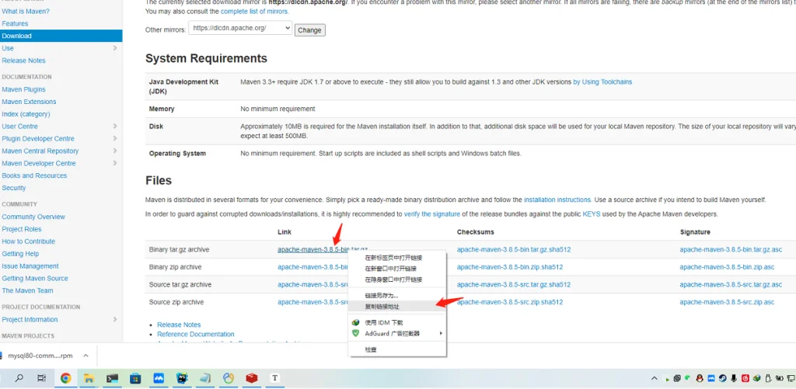

---
title: Linux 安装 Maven 并配置私服镜像
slug: maven-install
published: 2025-01-06 00:00:00
updated: 2025-01-06 00:00:00
description: 下载 Apache Maven tar.gz 包并配置环境变量，同时附上阿里云镜像与 Nexus 私服的 settings.xml 完整配置示例。
image: api
category: 中间件
tags: ["Maven", "Java", "环境配置"]
draft: false
# pinned: false
---

## 一、下载解压

官网下载：[https://maven.apache.org/download.cgi](https://maven.apache.org/download.cgi)

历史版本：[https://archive.apache.org/dist/maven/maven-3](https://archive.apache.org/dist/maven/maven-3)



> [!WARNING]
> `--no-check-certificate` 会跳过 SSL 证书验证，存在中间人攻击风险。仅在证书确实过期的特殊情况下临时使用。

```bash
# 下载 Maven 3.8.5（如提示证书过期，追加 --no-check-certificate）
wget https://archive.apache.org/dist/maven/maven-3/3.8.5/binaries/apache-maven-3.8.5-bin.tar.gz

# CDN 备用
# wget https://cdn.olinl.com/centos/apache-maven-3.8.5-bin.tar.gz  # 3.8.5
# wget https://cdn.olinl.com/centos/apache-maven-3.9.9-bin.tar.gz  # 3.9.9

# 解压并移动到 /opt
tar -zxvf apache-maven-3.8.5-bin.tar.gz
mv apache-maven-3.8.5 /opt/maven-3.8.5/
```

## 二、配置环境变量

```bash
# 编辑系统环境变量
vim /etc/profile

# 在末尾追加
# Maven 3.8.5
export MAVEN_HOME=/opt/maven-3.8.5
export PATH=.:$PATH:$MAVEN_HOME/bin

# 使配置生效
source /etc/profile

# 验证安装
mvn -version
```

## 三、settings.xml 配置

`settings.xml` 位于 Maven 安装目录的 `conf/` 下，主要配置项：

- `localRepository`：本地仓库路径
- `servers`：私服认证信息（账号/密钥）
- `mirrors`：镜像仓库地址

### 1. 阿里云公共镜像（推荐）

```xml
<mirror>
    <id>aliyun-repos</id>
    <name>Aliyun Public Repository</name>
    <url>https://maven.aliyun.com/repository/public</url>
    <mirrorOf>*,!bladex</mirrorOf>
</mirror>
```

### 2. Nexus 私服配置

> [!NOTE]
> 尚未搭建 Nexus 私服？参见：[Linux 搭建 Nexus Maven 私服完整指南](/posts/nexus-maven-private/)

在 `<servers>` 中配置认证：

```xml
<server>
    <id>nexus-maven</id>
    <username>admin</username>
    <password>admin123</password>
</server>
```

在 `<mirrors>` 中配置地址：

```xml
<mirror>
    <id>nexus-maven</id>
    <name>Nexus 私服</name>
    <url>http://192.168.2.10:3001/repository/nexus-group/</url>
    <mirrorOf>*,!bladex</mirrorOf>
</mirror>
```

### 3. 完整 settings.xml 示例

```xml
<?xml version="1.0" encoding="UTF-8"?>
<settings xmlns="http://maven.apache.org/SETTINGS/1.2.0"
          xmlns:xsi="http://www.w3.org/2001/XMLSchema-instance"
          xsi:schemaLocation="http://maven.apache.org/SETTINGS/1.2.0 https://maven.apache.org/xsd/settings-1.2.0.xsd">

  <!-- 本地仓库路径 -->
  <localRepository>/opt/maven/repository</localRepository>

  <servers>
    <!-- Nexus 私服认证 -->
    <server>
      <id>nexus-maven</id>
      <username>admin</username>
      <password>admin123</password>
    </server>
    <!-- 特殊 Token 认证示例 -->
    <server>
      <id>bladex</id>
      <configuration>
        <httpHeaders>
          <property>
            <name>Authorization</name>
            <value>token验证信息</value>
          </property>
        </httpHeaders>
      </configuration>
    </server>
  </servers>

  <mirrors>
    <!-- Nexus 私服（优先） -->
    <mirror>
      <id>nexus-maven</id>
      <name>Nexus 私服</name>
      <url>http://192.168.2.10:3001/repository/nexus-group/</url>
      <mirrorOf>*,!bladex</mirrorOf>
    </mirror>
    <!-- 阿里云公共镜像（备用） -->
    <mirror>
      <id>aliyun-repos</id>
      <name>Aliyun Public Repository</name>
      <url>https://maven.aliyun.com/repository/public</url>
      <mirrorOf>*,!bladex</mirrorOf>
    </mirror>
  </mirrors>

</settings>
```
