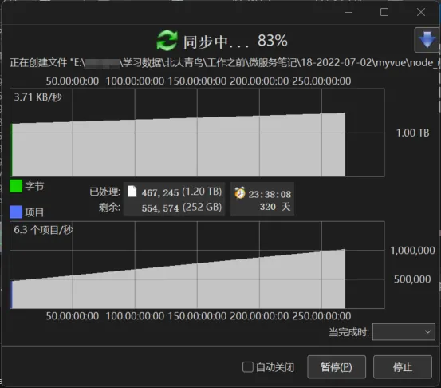
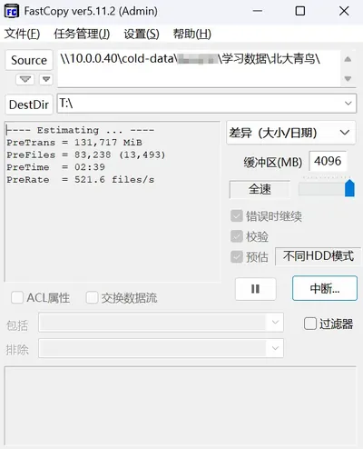
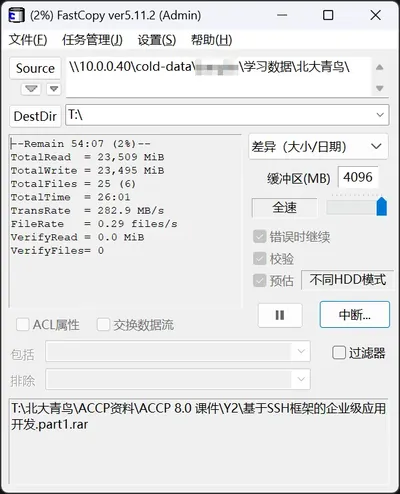

> [!NOTE]
> **AI 生成说明**：本篇文章由站长提供核心主体思路、方案对比维度及内容大纲，并由 AI 辅助润色与技术细节补充生成。

## 一、 核心瓶颈：为什么 NAS 怕碎文件？

在 NAS 存储中，处理 100 万个 1KB 的文件（如代码工程、网页素材、缩略图）远比处理 1 个 1GB 的视频文件困难，原因如下：

- **元数据灾难：** 每一份文件都有文件名、创建时间、权限等"元数据"。NAS 在读取文件夹时，需要逐一扫描这些索引。文件越多，索引树越庞大，导致开启文件夹时极度卡顿。
- **协议延迟：** 使用 SMB 协议访问 NAS 时，每传输一个文件都要进行一次"握手"请求。百万次握手产生的网络延迟叠加，会使传输速度从百兆降至几百 KB。
- **寻道压力：** 机械硬盘（HDD）在读写碎文件时，磁头需要频繁进行物理跳跃（随机读写），这会导致磁盘 IOPS 迅速耗尽，产生读写瓶颈。

## 二、 四大方案深度横向对比：ZIP vs ISO vs VHD vs VHDX

针对"个人单机使用"的场景，我们将四种常见的封装方案进行对比：

| 特性 | **ZIP/7Z 压缩包** | **ISO 光盘镜像** | **VHD 虚拟磁盘** | **VHDX 虚拟磁盘 (推荐)** |
| :--- | :--- | :--- | :--- | :--- |
| **读写灵活性** | 极低（修改需重新打包） | **只读**（不可修改） | 高（挂载后同本地硬盘） | **极高（实时读写，最先进）** |
| **性能表现** | 读取需解压，速度慢 | 读取极快，无写入 | 较好 | **优秀（支持 4K 对齐优化）** |
| **容量上限** | 视文件系统而定 | 约 8TB | 2 TB | **64 TB** |
| **数据安全性** | 损坏可能导致全包失效 | 极高（不可变） | 低（断电易损索引） | **高（具备 Metadata 日志保护）** |
| **动态扩展** | 不支持 | 不支持 | 支持 | **支持（用多少占多少）** |

**结论：** **VHDX** 是目前 Windows 环境下个人管理碎文件的最优解，它兼顾了硬盘的灵活性和镜像文件的整洁性。

## 三、 个人使用最佳实践：VHDX 方案详解

VHDX（Virtual Hard Disk v2）是微软推出的现代虚拟硬盘格式，非常适合存放在 NAS 上：

- **动态扩展（Thin Provisioning）：** 在创建时，你可以设定容量为 10TB，但在 NAS 上它初始只占用几百 KB。只有当你往镜像里存入文件时，它才会在 NAS 上真实增长体积。
- **本地化体验：** 挂载 VHDX 后，Windows 会分配一个盘符（如 `Z:` 盘）。所有的碎片文件操作都在这个虚拟盘内部完成，NAS 只负责同步那个巨大的 `.vhdx` 文件块，从而绕过了 SMB 的小文件握手瓶颈。
- **文件系统建议：** 建议在 VHDX 内部格式化为 **NTFS**，以获得最佳的日志恢复能力和压缩属性。

## 四、 工具推荐：工欲善其事，必先利其器

在将海量碎文件"装进" VHDX 镜像之前，选对搬运工具能节省数小时的时间。

### 1. FastCopy：海量碎文件的性能怪兽

如果你有几万甚至几十万个碎片文件需要首次搬迁，**FastCopy** 是不二之选。它绕过了系统 API 的多余限制，利用多线程直接读写。

*实测：处理 83,238 个文件，扫描速度达 521.6 files/s*

*实测：写入挂载的 VHDX 磁盘，速率高达 287.4 MB/s，彻底压榨带宽潜力*

### 2. TeraCopy：稳健派的备份神器

对于追求绝对安全的用户，TeraCopy 的**错误处理**机制更优。如果拷贝中途某个文件报错，它会跳过坏文件继续任务，而非像系统自带拷贝那样直接中断。

## 五、 操作实操：实现"一键化"管理

为了避免每次进入"磁盘管理"手动挂载，推荐以下两种方式：

### 1. 推荐工具：[Simple VHD Manager](https://gndown.lanzoub.com/iLEEP1b4vy3a) (免费/绿色)

这是一个轻量级管理工具，专门解决 VHDX 的挂载痛点，支持一键式操作。

- **一键添加：** 将 NAS 上的 VHDX 文件拖入软件列表。
- **右键集成：** 在软件设置中勾选"集成到右键菜单"。此后，你只需在 NAS 文件夹里对准 VHDX 文件 **右键 -> 附加 (Mount)**，驱动器会秒速出现。
- **自动挂载：** 您可以将其设置为随系统启动自动挂载，让 NAS 上的碎文件库像本地硬盘一样常驻。

### 2. Windows 原生操作 (无需软件)

- **一键挂载：** 直接 **双击** NAS 上的 `.vhdx` 文件，系统会自动将其映射为一个新盘符。
- **一键卸载：** 在"此电脑"中找到该盘符，**右键 -> 弹出**。

## 六、 进阶维护与安全策略

- **空间回收（瘦身）：**

> [!CAUTION]
>
> VHDX 动态扩展有一个特性——"只增不减"。即使你删除了镜像内的文件，NAS 上的文件体积也不会自动缩小。若需回收空间，需在挂载状态下使用 Windows 的驱动器优化工具或特定的 PowerShell 命令进行收缩。

- **避坑禁令（核心）：**

> [!WARNING]
>
> **绝对禁止两台电脑同时挂载同一个可写的 VHDX 文件**。由于 VHDX 不是集群文件系统，双重写入会导致文件分配表立即崩溃，数据全失且无法恢复。

- **备份建议：** 遵循 **3-2-1 备份原则**。虽然 VHDX 有日志保护，但它本质上还是一个大文件。建议定期将这个 `.vhdx` 文件备份到另一个独立的硬盘或云端存储中。
