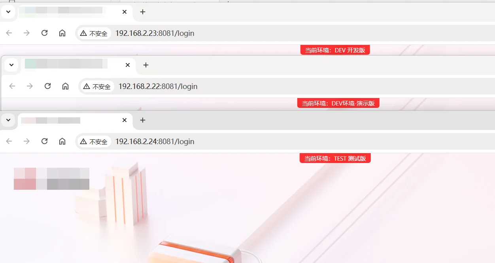

---
title: Nginx 使用 sub_filter 注入自定义 HTML 标签
slug: nginx-subfilter-html
published: 2025-04-11 00:00:00
updated: 2025-04-11 00:00:00
description: 通过 Nginx 的 ngx_http_sub_module 模块，在反向代理响应中注入自定义 JS、CSS 或 HTML 标签，适用于无法修改源码的第三方页面定制场景。
image: api
category: 中间件
tags: []
draft: false
# pinned: false
---

在反向代理第三方服务时，若需要在页面中注入自定义 JS/CSS，但无法修改源码，可以借助 Nginx 的 `sub_filter` 指令在响应内容中做字符串替换注入。

> [!NOTE]
> `sub_filter` 由 `ngx_http_sub_module` 模块提供，编译 Nginx 时需确认已包含该模块：

```bash
nginx -V 2>&1 | grep sub_filter
```

## 配置示例

> [!TIP]
> 尚未部署 Uptime Kuma？参见：[Docker 部署 Uptime Kuma 监控](/posts/docker-uptime-kuma/)

以下示例在代理 Uptime Kuma 状态页时，通过 `sub_filter` 在 `</head>` 前注入自定义资源：

```nginx title="/opt/nginx/http/status.conf"
map $http_upgrade $connection_upgrade {
    default upgrade;
    ''      close;
}

server {
    listen 80;
    server_name status.example.com;

    location ^~ /status/external {
        proxy_pass http://10.0.0.11:3001/status/external;

        proxy_set_header Host $http_host;
        proxy_set_header X-Real-IP $remote_addr;
        proxy_set_header X-Forwarded-For $proxy_add_x_forwarded_for;
        proxy_set_header X-Forwarded-Proto $scheme;

        proxy_http_version 1.1;
        proxy_set_header Upgrade $http_upgrade;
        proxy_set_header Connection $connection_upgrade;

        # 在 </head> 前注入自定义资源
        sub_filter '</head>' '<script src="/main.js"></script>';
        sub_filter '</head>' '<link rel="stylesheet" href="/main.css">';
        sub_filter '</head>' '<link rel="stylesheet" href="/iconfont.css">';

        sub_filter_once off;   # off = 替换所有匹配
        sub_filter_types *;    # 对所有 MIME 类型生效
    }
}
```

## 常用指令说明

| 指令 | 说明 |
|---|---|
| `sub_filter string replacement` | 将响应中的 `string` 替换为 `replacement` |
| `sub_filter_once on\|off` | `on`（默认）只替换第一处；`off` 替换全部匹配 |
| `sub_filter_types *` | 指定生效的 MIME 类型，默认仅 `text/html` |
| `sub_filter_last_modified on\|off` | 是否在替换后修改响应的 `Last-Modified` 头 |

## 注意事项

- 如果后端响应启用了 gzip 压缩，`sub_filter` 无法处理压缩内容，需在 `location` 内添加 `proxy_set_header Accept-Encoding "";` 禁用后端压缩。
- 注入的静态资源路径中不能使用动态变量，否则浏览器无法解析。建议将静态资源缓存到 Nginx 本地后统一提供。

## 实用功能

我们可以使用这个功能，区分dev、test环境，无需在代码层面做任何调整，非常丝滑

只需要在你的nginx配置里面添加下面一行代码即可实现；

```nginx
location / {
	# 插入自定义提示头
	sub_filter '</body><div style="position:fixed;top:0;left:50%;transform:translateX(-50%);background:red;color:white;padding:2px 10px;z-index:9999;font-size:12px;pointer-events:none;opacity:0.8;border-radius:0 0 5px 5px;">当前环境：DEV 开发版</div></body>';
	sub_filter_once on;
	
	root   $root/platform;  # 网站根目录
	index  index.html;   # 默认首页文件
	try_files  $uri $uri/ /index.html;
	add_header Access-Control-Allow-Origin *;
	add_header 'Access-Control-Allow-Credentials' 'true';
	add_header 'Access-Control-Allow-Methods' *;
	add_header 'Access-Control-Allow-Headers' *;
	add_header Cache-Control no-cache;
}

```

效果如下：还是比较美观的


