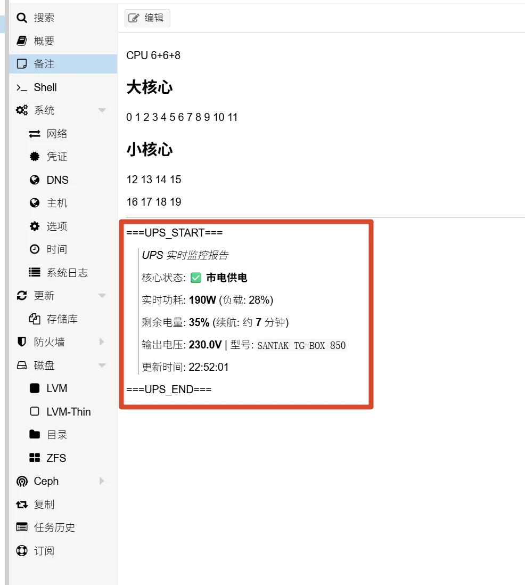
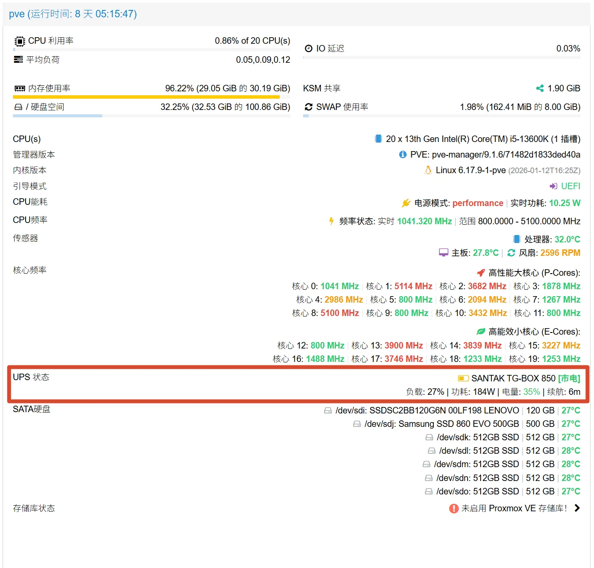
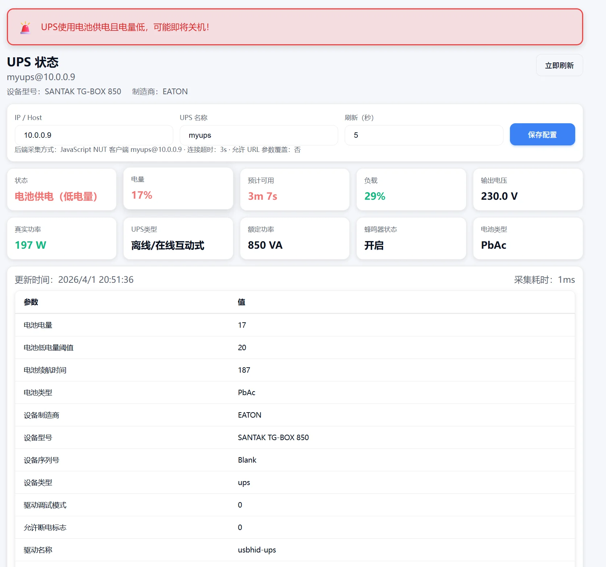
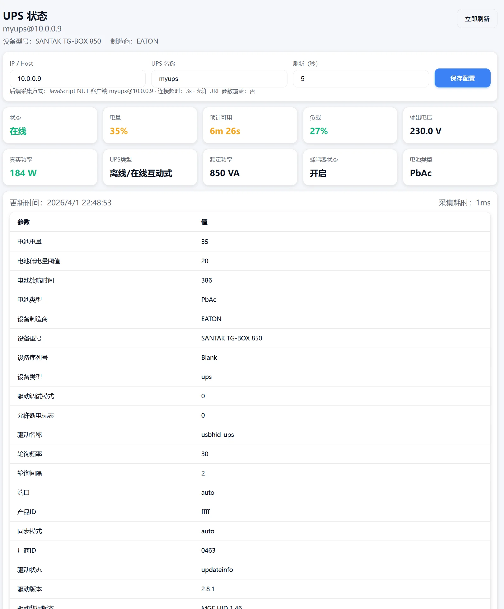
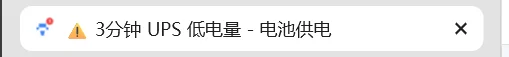

---
title: 为了护住我那几块硬盘：我的 UPS 监控“三部曲
slug: ups-monitoring-trilogy-nodejs
published: 2025-04-01 00:00:00
updated: 2025-04-01 00:00:00
description: 从 PVE 备注里的简陋脚本，到独立的 Node.js Web 监控页，记录一个 HomeLab 玩家的 UPS 监控进阶之路。
image: ./images/0001.webp
category: 站点
tags: ["UPS", "HomeLab", "Node.js", "PVE", "NUT"]
draft: false
# pinned: false
---

搞 HomeLab 的人，最后都会殊途同归地买台 UPS。毕竟看着那几块存满了"学习资料"的硬盘，谁也不想在停电时赌一把运气。

但 UPS 买回来后，怎么看状态就成了个问题。为了能随时随地盯一眼电量，我前前后后折腾了三个版本。

## 🛠️ 从"能看"到"优雅"：三个版本的演进

### v1.0：PVE 备注栏的"暴力补丁"

最开始的想法特别简单直接：既然我天天盯着 PVE 后台，那把 UPS 信息塞进 PVE 不就行了？

于是我写了个 Python 脚本，定时抓取 `upsc` 的数据，然后通过 PVE 的 API 强行写进节点的"备注"里。

* **现状**：能看，但丑。备注栏那一堆乱糟糟的字符，每次看都觉得自己像个原始人。

> 

### v2.0：魔改 PVE 的状态面板

后来不满足于备注栏，我开始打 PVE 源码的主意。通过修改 PVE 的 ExtJS 文件，我强行在宿主机的状态监控页里插了一个 UPS 的展示位。

* **现状**：看着很高级，和系统融为一体。但有个致命伤：只要 PVE 一更新，改动就全没了，得重新修代码，简直是体力活。

> 

### v3.0：独立 Web 版（UPS Web）

也就是这次要分享的终极方案：**不依赖宿主机系统，做一个彻底独立的监控页。**

这一次我用 Node.js 重新写了一套逻辑，最核心的一点是：**我用纯 JS 实现了 NUT（Network UPS Tools）客户端协议。** 这意味着它不再需要你安装任何 `upsc` 命令，只要能跑 Node 或 Docker 的地方，它就能直接和你的 UPS 服务器对话。

> 

---

## 🚀 深度看一眼 v3.0：UPS Web

这个小项目主打的就是 **轻量** 和 **解耦**。

### 为什么选它？

* **协议级通讯**：通过 TCP 直接与 `upsd` 对话，省去了中间层命令。
* **配置即时生效**：无需翻找后台 `config` 文件，网页输入 IP 即可。
* **极端环境适配**：当 UPS 进入 **OB（电池供电）** 且 **LB（低电量）** 时，整个页面会变为醒目的预警红，连浏览器标签页都会同步闪烁。





---

## 📦 部署指南

为了方便复刻，我将 v3.0 整理成了标准项目。推荐使用 Docker 部署，以保持环境整洁。

### 方法一：使用 Docker（推荐）

为了确保你在网页上修改的配置不会因为容器重启而丢失，请务必挂载配置文件：

```bash
# 创建配置存储文件
touch config.json

# 运行容器
docker run -d \
  --name ups-web \
  -p 8765:8765 \
  -v $(pwd)/config.json:/app/config.json \
  -e HOST=0.0.0.0 \
  -e PORT=8765 \
  --restart always \
  ups-web
```

### 方法二：源码运行

如果你想直接在 Node.js 环境下跑：

```bash
git clone https://github.com/olinll/nut-guard.git
cd nut-guard
npm install
npm start
```

---

## 🔧 技术实现亮点：纯 JS 版 NUT 客户端

市面上大多数监控都是通过 `child_process` 调用系统命令，而我选择直接在 Node.js 里构建 TCP 连接。

```javascript
// 核心逻辑片段：向 NUT Server 请求数据
const client = net.connect({ host: UPS_IP, port: 3493 }, () => {
  client.write(`LIST VAR ${UPS_NAME}\n`);
});

client.on('data', (data) => {
  // 解析成 JSON 对象供前端调用
  const metrics = parseNutData(data.toString());
  // ...
});
```

这种做法不仅减小了镜像体积（无需安装 `nut-client`），更让数据上报的延迟降到了毫秒级。

---

## ⚠️ 安全与避坑提醒

> [!WARNING]
> 该项目暂未内置登录鉴权，暴露到公网存在安全风险。建议配合 Nginx Access List 限制访问，或仅在局域网内使用。

1.  **权限控制**：该项目暂未内置登录鉴权，建议配合 **Nginx Proxy Manager** 加上 Access List，或者仅在局域网内使用。
2.  **配置冲突**：通过 URL 参数 `?ip=10.0.0.1` 临时查看时，不会改写 `config.json`。
3.  **持久化**：如果是在 PVE 容器（LXC）里跑，记得开启相应的网络权限。

## 🎬 结语

从最开始在备注栏抠字，到如今拥有一个独立的监控大屏，这不仅是为了护住那几块硬盘，更是折腾 HomeLab 的乐趣所在。

目前项目已在 GitHub 开源：

::github{repo="olinll/nut-guard"}

---

**代码可以重构，但那份热爱不该被"回收"。**

写博客就像往深不见底的井里丢石头，有时候很久都听不到回声。但如果此刻的你正读到这里，说明那颗石头终于撞到了什么。

如果你也曾在这座"赛博荒岛"上停留，哪怕只是为了看一眼那个 UPS 监控的 Bug 怎么解，也请留下你的足迹。哪怕只是发一个 ping，我也能回你一个 pong。

*证明一下，除了那些爬虫机器人，这个岛上真的有过人类。*

## 编辑建议

> 以下建议基于本条目内容生成，仅供发布前参考。

### 文章内容建议
- v1.0 / v2.0 段落缺少"具体实现细节"：仅给了思路（备注栏、魔改 ExtJS），建议补一段 v1 脚本的核心代码片段（`upsc` → PVE API 调用），方便读者复用思路
- v3.0 部署章节缺少"版本与依赖"小节：建议补 Node.js 推荐版本（如 18+/20+）和 `config.json` 的字段说明（IP、port、ups_name 怎么填）
- 缺少"v2.0 魔改 PVE 升级兼容方案"——既然痛点写明了"PVE 一更新就全没了"，可以补一句"用 `dpkg-divert` 钩子或挂载 patch 文件"的具体解法
- 末尾作者抒怀（石头、ping/pong）与技术文章调性冲突明显，建议在文末用引用块 `>` 隔开，区分技术正文与作者随笔

### 修改建议
- 标题里"三"用了中文数字"三部曲"是西文标点夹杂，建议统一为"我的 UPS 监控三部曲"或 "UPS 监控 '三部曲'"，避免被搜索引擎识别为"曲"而误匹配音乐
- `image: ./images/0001.webp` 三处图片路径相同（v1/v2/v3 cover 全用 ups-v3-pve-ui.webp），建议核对 `images/` 目录，补上 v1/v2 的实际截图
- `--slave-info` 参数在 MySQL 8.0+ 单主场景下没有意义（没有 slave），建议在 `## 四` 加一句注释或删除该参数

### 合并建议
- 候选合并对象：`xtrabackup-backup`（同属 HomeLab 私有云 + 监控/备份主题）
- 合并理由：均为"为硬盘保驾护航"系列，叙事风格（从 v1 演进到 v3）与"备份从全量到增量"演进模式相似，但内容独立性较强、读者检索路径不同，建议保留独立篇目，在 `xtrabackup-backup` 末尾的"相关文章"链接中互引

### slug 建议
- 当前：`ups-monitoring-trilogy-nodejs`
- 建议：保留
- 理由：slug 准确包含核心信息（UPS 监控 + Node.js），无歧义；"trilogy"呼应文中三版演进，具识别度

### 分类建议
- 建议归类到：**服务**（保持现 `HomeLab 私有云` 也可，理由：这是"自建监控"应用）
- 理由：项目本身是一个可独立部署的 Web 服务（Node.js + Docker），符合"服务"分类定义；现分类 HomeLab 更偏向场景叙事，分类粒度偏粗

### tags 建议
- 建议：`[UPS, NUT, 监控, Node.js]`
- 与现状对比：`[UPS, HomeLab, Node.js, PVE, NUT]`，差异说明：去掉 `HomeLab`（属场景非技术）和 `PVE`（文章已强调"不依赖宿主机系统"），新增 `监控`（核心功能主题词），保留 4 个 tag 信息密度更高

### 其他建议
- 配图建议：v3 独立 Web 监控页可再补一张"正常状态（绿/蓝）" 与 OB+LB 红色预警的对比图，配合 1080p+ 截屏更清晰
- 缺少"项目 Star/反馈渠道"小节：既然是 GitHub 开源（`olinll/nut-guard`），建议在末尾加一句"遇到问题欢迎提 Issue"形成闭环
