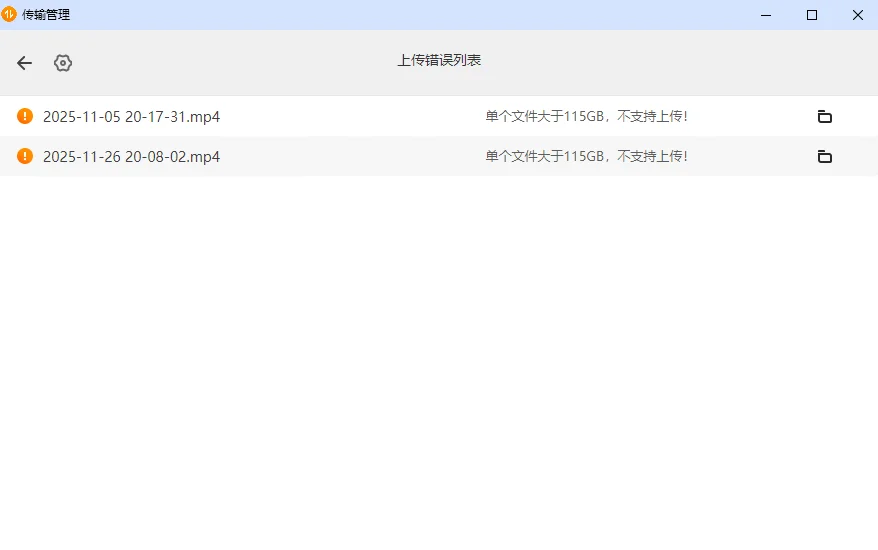

---
title: 视频压缩指南
slug: video-compression
published: 2025-03-03 00:00:00
updated: 2025-03-03 00:00:00
description: 录个屏硬盘炸了？一个视频300G？教你把大文件压缩到100G以下
image: ./images/0001.webp
category: HomeLab
tags: ["视频处理", "ffmpeg"]
draft: false
# pinned: false
---

## 一、前言

由于入手了115网盘会员，我决定将本地NAS中积攒多年的视频文件，一股脑儿迁移到云端备份，顺便也把NAS里的文件好好梳理一番。

作为一个资深"囤囤鼠"玩家，我的NAS里堆满了各种游戏的录屏、直播回放，文件数量多到令人头疼。整理过程中，一个最大的拦路虎出现了：**大量单个视频文件超过了115GB**。而115网盘有个硬性门槛——**不支持上传超过115GB的单个文件**。



直接上传的路被堵死了，但办法总比困难多。我的解决思路是：**既然文件太大，那就给它"瘦身"**。不是简单地压缩，而是采用比原始视频更高效的编码格式进行重新编码，这样可以在几乎不影响画质的前提下，将文件体积大幅缩减。比如，一个273GB的直播录像，压缩后可以轻松控制在100GB以内。

下面，我就把这次"瘦身"迁移的完整操作和经验分享出来，希望能帮到同样被大文件上传问题困扰的你。

## 二、查看原视频信息

在动手压缩之前，我们需要先了解原始视频的基本信息。这就像医生看病前的检查，能帮助我们制定最合适的"治疗方案"。

### 1. 为什么要先查看视频信息？

不同的视频编码、分辨率、码率，压缩的潜力和采用的策略都不一样。比如：

如果视频已经是H.265编码，压缩空间就很小

如果是H.264编码的4K高码率视频，压缩空间就非常大

### 2. 用FFprobe查看视频信息

FFmpeg家族中有一个小工具叫`ffprobe`，专门用来查看视频文件的详细信息：

```bash
ffprobe -v error -show_entries stream=codec_name,width,height,r_frame_rate,bit_rate -show_entries format=duration,bit_rate "你的视频文件.mp4"
```

输出示例：

```bash
codec_name=h264
width=2560
height=1440
r_frame_rate=60/1
bit_rate=61823000
duration=37877.100000
```

从这些信息中我们可以解读出：

- `编码格式`：H.264（压缩空间巨大）
- `分辨率`：2560x1440（2K）
- `帧率`：60fps
- `码率`：约61.8 Mbps（非常高）
- `时长`：约10.5小时

关键判断：如果是H.264编码，意味着我们可以通过升级到H.265或AV1编码，在不明显降低画质的情况下，将文件体积缩小50%-70%。

## 三、实操

### 1. 下载FFmpeg

访问 FFmpeg [官网下载](https://ffmpeg.org/download.html)页面，选择适合你操作系统的版本:

Windows用户：选择"Windows builds by [gyan.dev](gyan.dev)"或"[BtbN](https://github.com/BtbN/FFmpeg-Builds/releases)"版本，下载压缩包

macOS用户：可以用Homebrew安装 brew install ffmpeg

Linux用户：直接用包管理器 sudo apt install ffmpeg

**Windows**

如果临时使用，可以直接打开 bin文件夹，在命令行里面使用 `ffmpeg` 命令即可

长期使用推荐配置环境变量

1. 将下载的压缩包解压到某个目录，比如 C:\ffmpeg
2. 右键点击"此电脑" → "属性" → "高级系统设置" → "环境变量"
3. 在"系统变量"中找到"Path"，点击"编辑"
4. 添加FFmpeg的bin目录路径，例如 C:\ffmpeg\bin
5. 一路点击"确定"保存

**验证安装**：打开命令提示符，输入 ffmpeg -version，如果显示版本信息，说明安装成功。

### 2. 压缩方案

|编码格式 |	压缩效率 |	硬件支持 |	适用场景 |
| --- | --- | --- | --- |
|H.264	| 基准 |	几乎所有设备 |	兼容性之王，但体积最大 |
|H.265/HEVC |	比H.264节省40-50% |	2015年后设备普遍支持 |	当前最均衡的选择 |
|AV1	| 比H.264节省50-70% |	RTX 40/50系、Intel Arc、AMD RX 7000系 |	追求极致压缩，硬件较新 |

> [!NOTE]
> AV1 硬件编码需要 RTX 40/50 系列、Intel Arc 或 AMD RX 7000 系列显卡。旧显卡只能使用 CPU 软编码（libsvtav1），速度较慢但压缩率更高。

|VP9	| 接近H.265 |	部分设备支持 |	YouTube常用，但逐渐被AV1取代 |

**H.265 vs AV1：怎么选？**

**H.265（HEVC）的优势：**

- 兼容性好，2015年后的电视、手机、盒子基本都支持
- 编码速度快，硬件加速成熟
- 文件体积控制优秀

**AV1的优势：**

- 压缩率更高，同样画质下比H.265再小20-30%
- 开源免费，无专利授权费用
- 下一代视频编码标准

**我的建议：**

- 如果追求省心、要在多设备播放 → 选H.265
- 如果硬件较新（RTX 40/50系）、追求最小体积 → 选AV1

### 3. 使用AV1编码

**使用NVIDIA显卡进行硬编码**

```bash
ffmpeg -i "input.mp4" -c:v av1_nvenc -cq 32 -preset p7 -c:a copy -movflags +faststart output_av1.mp4
```

参数详解：

- -c:v av1_nvenc：调用NVIDIA显卡的AV1硬件编码器
- -cq 32：质量参数，数值越小画质越好（推荐范围28-35）
- -preset p7：编码预设，p7是最高质量（最慢）
- -c:a copy：直接复制音频，不重新编码
- -movflags +faststart：优化网络播放

**使用CPU进行软编码**

```bash

ffmpeg -i "input.mp4" -c:v libsvtav1 -crf 35 -preset 6 -c:a copy -movflags +faststart output_cpu_av1.mp4

```

参数解释：

- -c:v libsvtav1：使用CPU的SVT-AV1编码器（软件编码）
- -crf 35：画质参数（0-63），数值越小画质越好。35是平衡点，如果想更小可以调到40-45
- -preset 6：速度预设（0-13），数字越小越慢、压缩率越高。6是平衡点，如果想更小用preset 4或2，但会慢很多

### 4. 使用H265编码

**使用NVIDIA显卡进行硬编码**

```bash
ffmpeg -i input.mp4 -c:v hevc_nvenc -cq 28 -preset p7 -c:a copy -movflags +faststart output_h265_nvenc.mp4
```

参数详解：

- -c:v hevc_nvenc：调用NVIDIA的H.265硬件编码器（GPU工作）

> [!TIP]
> H.265 硬编码推荐 `-cq 28-32`，兼顾文件体积与画质。RTX 40/50 系列使用 `-preset p7` 仍保持较快速度。

- -cq 32：质量参数，数值越小画质越好（推荐范围28-35）
- -preset p7：NVIDIA预设，p1最快（质量最差），p7最慢（质量最好）。RTX 40/50系用p7依然很快
- -c:a copy：直接复制音频，不重新编码
- -movflags +faststart：优化网络播放

**使用CPU进行软编码**

```bash

ffmpeg -i input.mp4 -c:v libx265 -crf 24 -preset medium -c:a copy -movflags +faststart output_h265_cpu.mp4

```

参数解释：

- -c:v libx265：调用x265软件编码器（CPU工作）
- -crf 24：画质参数（0-63），数值越小画质越好。35是平衡点，如果想更小可以调到40-45
- -preset medium：控制编码速度与压缩率的平衡。从快到慢：ultrafast → superfast → veryfast → faster → fast → medium → slow → slower → veryslow。越慢文件越小，但时间成倍增加多

### 5. CRF值参考表（不同分辨率）

|画质目标 |	720p |	1080p |	4K|
| --- | --- | --- | --- |
|近乎无损 |	14 |	16 |	18|
|高质量 |	18 |	22 |	24|
|中等质量 |	24 |	26 |	28|
|低质量 |	28 |	30 |	32|

经验法则：CRF每增减6，文件大小大约翻倍或减半

### 5. 主流编码器命名大全

**软件编码器（CPU工作）**

| 编码器名称 | 来源 | 编码格式 |
|-----------|------|---------|
| `libx264` | x264项目 | H.264 |
| `libx265` | x265项目 | H.265/HEVC |
| `libsvtav1` | Intel SVT项目 | AV1 |
| `libaom-av1` | Alliance for Open Media（开放媒体联盟）参考实现 | AV1 |
| `librav1e` | 纯Rust实现的AV1编码器 | AV1 |
| `libvpx-vp9` | Google VPx项目 | VP9 |
| `libvpx-vp8` | Google VPx项目 | VP8 |

**NVIDIA硬件编码器（GPU工作）**

| 编码器名称 | 含义 | 硬件要求 |
|-----------|------|---------|
| `av1_nvenc` | NVIDIA硬件AV1编码 | RTX 40/50系 |
| `hevc_nvenc` | NVIDIA硬件H.265编码 | GTX 10系以上（Maxwell架构以后） |
| `h264_nvenc` | NVIDIA硬件H.264编码 | 几乎所有NVIDIA显卡 |

**Intel硬件编码器（核显/独显）**

| 编码器名称 | 含义 | 硬件要求 |
|-----------|------|---------|
| `av1_qsv` | Intel QSV硬件AV1编码 | Intel Arc独显或11代以上核显 |
| `hevc_qsv` | Intel QSV硬件H.265编码 | 6代酷睿以上 |
| `h264_qsv` | Intel QSV硬件H.264编码 | 几乎所有Intel核显 |

**QSV是什么**？Quick Sync Video，Intel的硬件加速技术品牌。

**AMD硬件编码器**

| 编码器名称 | 含义 | 硬件要求 |
|-----------|------|---------|
| `av1_amf` | AMD AMF硬件AV1编码 | RX 7000系列 |
| `hevc_amf` | AMD AMF硬件H.265编码 | RX 400系列以上 |
| `h264_amf` | AMD AMF硬件H.24编码 | 几乎所有AMD显卡 |

**AMF是什么**？Advanced Media Framework，AMD的硬件加速技术品牌。

**Apple硬件编码器**

| 编码器名称 | 含义 | 硬件要求 |
|-----------|------|---------|
| `hevc_videotoolbox` | Apple VideoToolbox H.265编码 | M1/M2/M3系列或Intel Mac |
| `h264_videotoolbox` | Apple VideoToolbox H.264编码 | 几乎所有Mac |

### 6. 如何查看你的FFmpeg支持哪些编码器

**列出所有编码器**

```bash
# 查看所有编码器
ffmpeg -encoders

# 用grep筛选特定格式（Windows用findstr）
ffmpeg -encoders | grep -E "x265|nvenc|qsv|amf|svt"
# Windows版：
ffmpeg -encoders | findstr "x265 nvenc qsv amf svt"
```

**查看编码器详细信息**

```bash
# 查看libx265的详细参数
ffmpeg -h encoder=libx265

# 查看hevc_nvenc的详细参数
ffmpeg -h encoder=hevc_nvenc

# 查看libsvtav1的详细参数
ffmpeg -h encoder=libsvtav1
```

## 四、进阶技巧：预估压缩时间和最终大小

### 1. 实时查看进度

在FFmpeg命令执行时，屏幕上会不断更新类似这样的信息：

```bash
frame= 4690 fps=157 q=82.0 size=   99328KiB time=00:01:18.03 bitrate=10427.0kbits/s speed=2.61x
```

**关键指标解读**：

| 参数 | 含义 | 怎么看 |
|------|------|--------|
| **speed=2.61x** | 编码速度 | **最核心指标**，表示比实时播放快2.61倍 |
| **time=01:18.03** | 已处理时长 | 已经处理了1分18秒 |
| **fps=157** | 每秒处理帧数 | 数值越高越快 |
| **size=99MB** | 当前输出大小 | 可以用来推算最终文件大小 |

### 2. 估算总时间

公式：**总时长 ÷ speed值 = 预计编码时间**

**实测案例对比**：

| 视频规格 | 速度 | 10小时视频所需时间 | 最终大小 |
|---------|------|-------------------|---------|
| 1080p (RTX 5060) | 6.87x | 约1.5小时 | 约38GB |
| 2K (RTX 5060) | 2.61x | 约4小时 | 约50GB |
| 1080p (CPU编码) | 0.2-0.5x | 20-50小时 | 约25-30GB |

## 五、常见问题与解决方案

### 问题1：网络路径无法访问

**错误信息**：

```
Error opening input file \\NAS\share\video.mp4: Invalid argument
```

**解决方案**：

1. **映射网络驱动器**（推荐）：
   - 在资源管理器中右键点击"此电脑" → "映射网络驱动器"
   - 选择一个盘符（如Z:），输入NAS路径
   - 用 `Z:\video.mp4` 替代网络路径

2. **复制到本地**：
   - 先将文件复制到本地硬盘，压缩完成后再拷回去

### 问题2：速度突然变慢

**可能原因**：

- 散热问题导致显卡降频
- 后台有其他程序占用资源
- 读取源文件的硬盘速度跟不上

**解决方法**：

- 监控GPU温度（用MSI Afterburner等工具）
- 关闭不必要的后台程序
- 确保源文件和输出文件在不同硬盘上

### 问题3：压缩后无法播放

**原因**：播放设备不支持AV1或H.265硬解

**解决方案**：

- 改用H.265编码（兼容性更好）
- 用VLC、MPC-BE等支持软解的播放器
- 升级播放设备

## 附录：常用FFmpeg命令速查表

| 需求 | 命令 |
|------|------|
| 查看视频信息 | `ffprobe -v error -show_format -show_streams input.mp4` |
| AV1硬件编码 | `ffmpeg -i input.mp4 -c:v av1_nvenc -cq 32 -preset p7 output.mp4` |
| H.265硬件编码 | `ffmpeg -i input.mp4 -c:v hevc_nvenc -cq 28 -preset p7 output.mp4` |
| 截取片段测试 | `ffmpeg -ss 00:10:00 -t 60 -i input.mp4 -c copy test.mp4` |
| 仅复制不压缩 | `ffmpeg -i input.mp4 -c copy output.mp4` |

## 最后

经过这次近10TB视频的迁移压缩，我总结了以下经验：

**囤囤鼠的最终归宿是上云**

本地NAS再大，也总有满的一天。115网盘的115GB限制看似麻烦，其实是逼着我们梳理文件、优化存储。经过这一轮压缩整理，我的NAS清爽多了，云端备份也更安心。

**祝大家上传顺利，永不"文件过大"！**

如果你在操作过程中遇到问题，欢迎在评论区留言交流。本文所有命令均经过实测，但具体参数可能需要根据你的视频源微调。

## 编辑建议

> 以下建议基于本条目内容生成，仅供发布前参考。

### 文章内容建议
- **缺少"批量压缩"实操**：文章只给了单文件命令，但读者场景是"NAS 里堆满视频"——建议增加"## 进阶：批量压缩脚本"小节，给出 `for f in *.mp4; do ffmpeg -i "$f" ...; done` 或 `find ... -exec` 示例
- **缺少"字幕/音轨"处理**：压缩时容易丢字幕或音轨；建议补"## 进阶：保留字幕与多音轨"小节，给出 `-c:s copy -map 0` 完整参数组合
- 标题"压缩指南"和 description"100GB以下"具体阈值清晰，但**正文中找不到"如何从 273GB 压到 100GB 以内"的实测对比**——建议补一节"## 实测案例"给 1-2 个具体视频的"原始大小 → CRF/cq → 压缩后大小"对照表
- 第三章"FFmpeg 下载"对 **macOS 用户**只给了 `brew install ffmpeg` 一行，建议补"Homebrew 安装的 ffmpeg 默认不带 libsvtav1 / nvenc，需要 `brew install ffmpeg --with-libsvtav1` 等"的踩坑提醒

### 修改建议
- 第三章有两个"### 5."（CRF 参考表 + 主流编码器命名大全），**章节编号重复**导致 TOC 跳转错乱；建议把后一个改为"### 6."或"### 七、"
- 4.2 节"实测案例对比"表中"10小时视频所需时间"用空格分隔数字（如"约1.5小时"）建议统一加全角空格"约 1.5 小时"保持可读性
- 第三章"### 4. 使用H265编码"参数详解只给了 4 条，**漏掉了 `-movflags +faststart` 的解释**（上一节有，这一节没有）；建议统一

### 合并建议
- 候选合并对象：`chrome-hardware-acceleration`
- 合并理由：均涉及"GPU 硬件加速"主题（NVENC/QSV/AMF）
- 综合判断：建议**保留独立**——本文核心是"FFmpeg 编码参数"，chrome-hardware-acceleration 是"浏览器 GPU 开关"，场景差异大；但可在两文末尾互引"## 相关主题"区块形成"GPU 加速"内容矩阵

### slug 建议
- 当前：`video-compression`
- 建议：保留或改 `ffmpeg-video-compression-guide`
- 理由：当前 slug 简洁但太宽泛（"视频压缩"是个大领域）；改为 `ffmpeg-video-compression-guide` 明确工具，但会破坏现有 URL，权衡后建议保留

### 分类建议
- 建议归类到：**随笔**（不太准确）或 **开发**（更合适）
- 理由：本文是"工具使用指南"型教程，本质是开发/技术类；但作者定位为"技术插曲与避坑"也可接受——FFmpeg 跨多媒体与开发两边，建议改分类为"开发"以匹配"工具使用"的属性

### tags 建议
- 建议：`[FFmpeg, 视频, 硬件加速]`
- 与现状对比：`[视频处理, ffmpeg]`，差异说明：把"视频处理"拆为更精准的 `视频` + `硬件加速`（核心主题词），把 `ffmpeg` 改为更规范的 `FFmpeg`（专有名词大写）

### 其他建议
- 配图建议：可补一张"273GB → 100GB 前后对比"或"ffmpeg 实时进度截图"作为头图/案例图
- 文档稳定性建议：`-cqp`、`-cq`、`-crf` 等质量参数在不同编码器下语义不同，建议加一节"## 附录：NVENC 的 cq vs libx265 的 crf 对照"避免读者混淆
